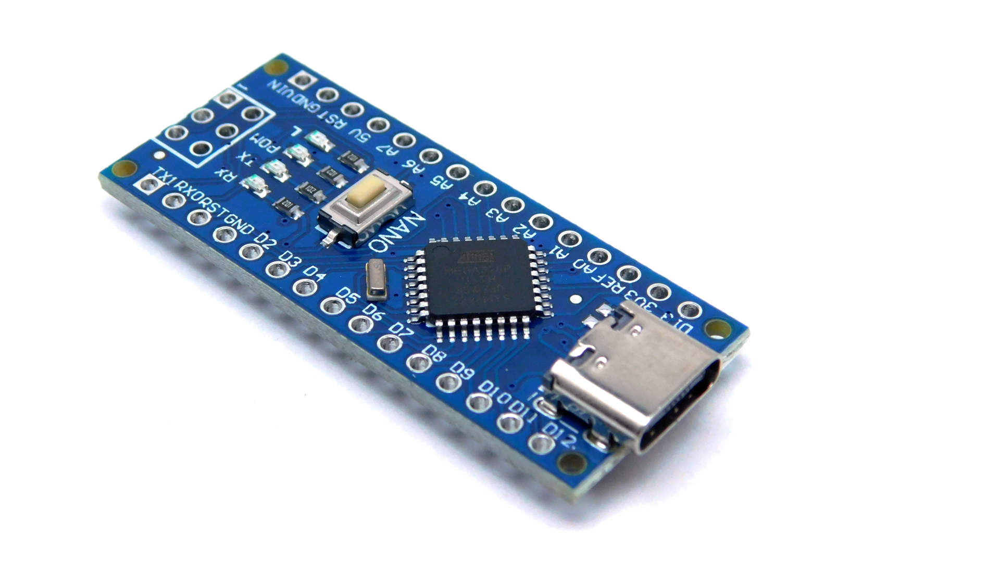

# Tiêu đề  H1
## Tiêu đề  H2
### Tiêu đề  H3

> Dòng trích dẫn

?> Note có background màu xanh

!> Note có background màu đỏ

**Chữ in đậm**

*Chữ in nghiêng*

***Chữ vừa in đậm vừa in nghiêng***

~~Gạch bỏ chữ~~

Danh sách không thứ tự
- Mục 1
- Mục 2
  - Mục con

Danh sách có thứ tự
1. Mục 1
2. Mục 2
   1. Mục con

Vẽ đường ngang (separator)
***

Gắn hyperlink vào text
[Đi đến website Chipstack](https://chipstack.vn)

Chèn `inline code`

Block code được viết như sau:

```cpp
print("Hello, Markdown!")
```

```js
// Simple JavaScript code to greet the user
let userName = prompt("What is your name?");
alert("Hello, " + userName + "! Welcome to JavaScript!");
```

Tạo bảng

| Tiêu đề 1 | Tiêu đề 2 |
|-----------|-----------|
| Hàng 1    | Dữ liệu 1 |
| Hàng 2    | Dữ liệu 2 |

Danh sách kiểm tra
- [ ] Công việc 1
- [x] Công việc 2 (đã hoàn thành)

Chèn emoji :smile: :heart: :rocket:

Chèn font-awesome :fas fa-home fa-fw blue: Xem thêm tại [đây](https://fontawesome.com/) 

Chèn hình ảnh


Viết Tabs

<!-- tabs:start -->

#### **Tab 1**

Nội dung tab 1

#### **Tab 2**

Nội dung tab 2

#### **Tab 3**

Nội dung tab 3

<!-- tabs:end -->

Viết command line trên terminal

```terminal
    $|warning|npm run build
    >|info|npm run start
    >|error|npm run start
    >|success|npm run start
    $ normal command line
```