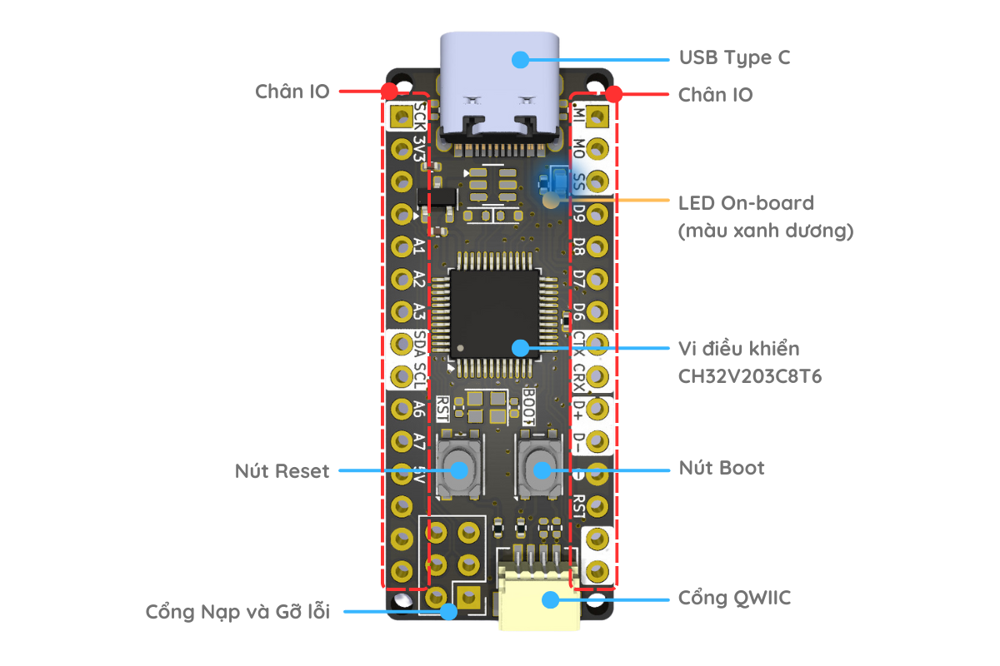

 
 
 

# Thông số kỹ thuật

|           | Zerobase 2 |
|-----------|-----------|
| MCU | CH32V203C8T6 |
| CPU | RISC-V |
| Điện áp MCU | 3V3 |
| Xung nhịp | 144 MHz |
| Bộ nhớ | 20 KB |
| Flash | 64 KB |
| Nguồn cấp | Qua USB, chân 5V |
| Điện áp IO | 3.3V |
| Dải nhiệt độ | -40C to 85C |
| Tương thích chân Arduino | :fas fa-square-check fa-fw blue: |
| Kích thước | 43.18 mm x 17.78 mm |
| Kiểu chân | Through hole |
| Tổng số chân | 30 |
| Số chân Digital | 22 |
| Số chân Analog | 6 | 
| Số chân PWM | TBD | 
| I2C | 2 | 
| SPI | 2 | 
| UART | 3 |
| USB | 2 |
| CAN | 1 |
| LDO | :fas fa-square-check fa-fw blue: |
| Cổng QWIIC | :fas fa-square-check fa-fw blue: |
| Arduino IDE | :fas fa-square-check fa-fw blue: |
| Bootloader | Hard |
| Nút Boot | :fas fa-square-check fa-fw blue: |
| Nút Reset | :fas fa-square-check fa-fw blue: |
| LED On-board | :fas fa-square-check fa-fw blue: |
| Chân nối WCH-LinkE | :fas fa-square-check fa-fw blue: |

## Các thành phần trên board

## Kích thước

