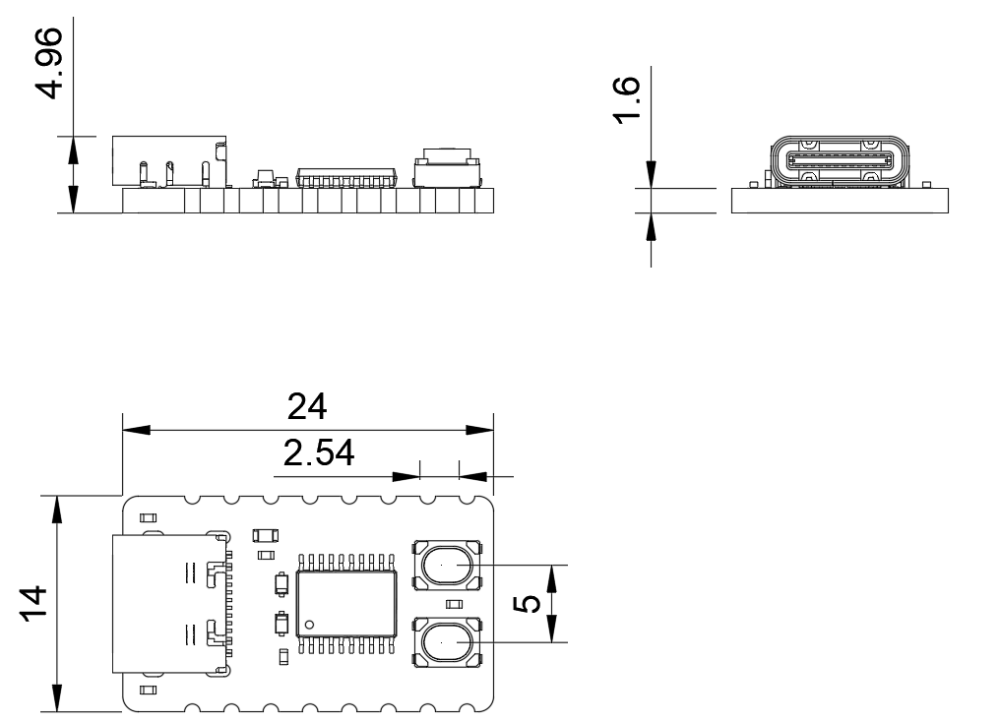

 
 
 

# Thông số kỹ thuật

|           | Zerobase Core |
|-----------|-----------|
| MCU | CH32V003F4P6 |
| CPU | RISC-V |
| Điện áp MCU | 5V |
| Xung nhịp | 48 MHz |
| Bộ nhớ | 2 KB |
| Flash | 16 KB |
| Nguồn cấp | Qua USB, chân 5V |
| Điện áp IO | 5V |
| Dải nhiệt độ | -40C to 85C |
| Tương thích chân Arduino | :fas fa-square-check fa-fw blue: |
| Kích thước | 24 mm x 14 mm |
| Kiểu chân | Half hole |
| Tổng số chân | 16 |
| Số chân Digital | 13 |
| Số chân Analog | 4 |
| Số chân PWM | TBD |
| I2C | 1 |
| SPI | 1 |
| UART | 1 |
| USB | 0 |
| CAN | 0 |
| LDO | :fas fa-times-square fa-fw red: |
| Cổng QWIIC | :fas fa-times-square fa-fw red: |
| Arduino IDE | :fas fa-square-check fa-fw blue: |
| Bootloader | Soft |
| Nút Boot | :fas fa-square-check fa-fw blue: |
| Nút Reset | :fas fa-square-check fa-fw blue: |
| Chân nối WCH-LinkE | :fas fa-square-check fa-fw blue: |

