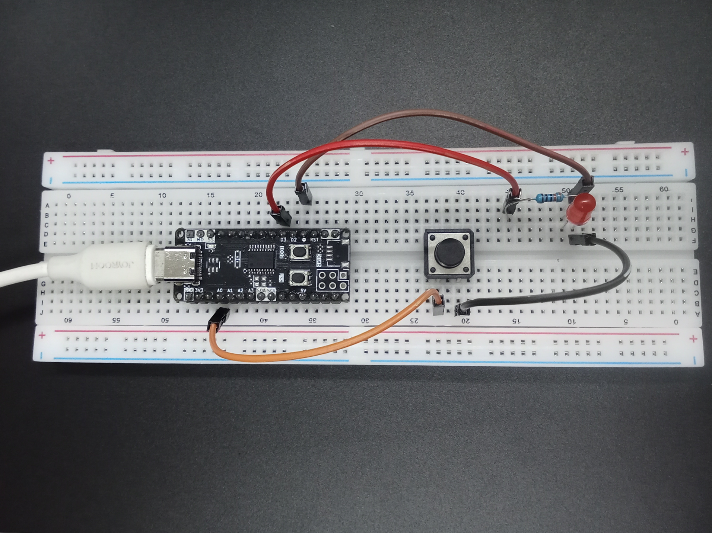
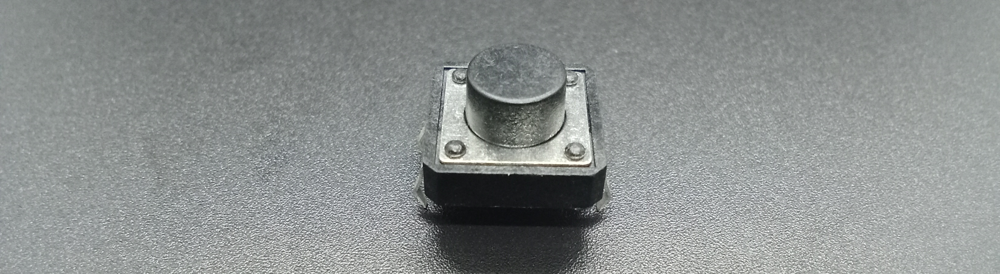
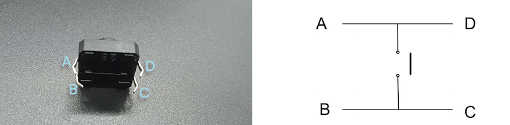
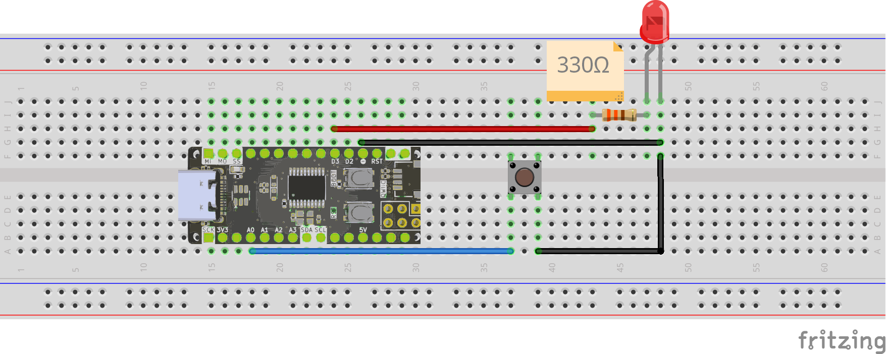
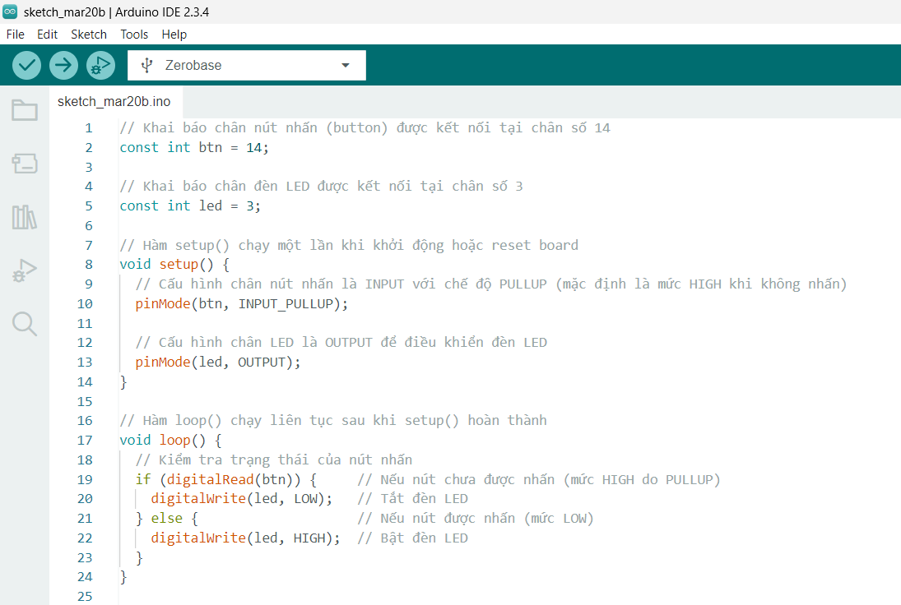

<br>
<br>
<br>

# Điều khiển đèn LED bằng nút bấm



## Tổng quan

Bài viết này hướng dẫn cách sử dụng nút bấm với Zerobase để điều khiển LED.

## Chuẩn Bị

> Zerobase


> Nút bấm



> Dây nối


> Điện trở 330Ω


> LED


## Nguyên Lý Hoạt Động

### Nút bấm



Nút nhấn 4 chân có hai cặp chân (A-D và B-C), trong đó A nối với B, D nối với C. Khi không nhấn, A-D không kết nối với B-C vì bị hở mạch. Khi nhấn nút, A-D nối với B-C tạo thành đường dẫn điện.

Nút này thường dùng trong vi điều khiển và mạch điện tử để tạo tín hiệu điều khiển. Khi kết hợp với điện trở kéo (pull-up hoặc pull-down), nó giúp xác định rõ trạng thái bật/tắt trong mạch.

### LED


LED (Light Emitting Diode) là một loại diode phát sáng. Khi có dòng điện chạy qua (từ cực Anode (+) sang cực Cathode (-)), nó phát ra ánh sáng. Để bảo vệ LED, cần mắc nối tiếp một điện trở để giảm dòng điện.

## Các Chân Kết Nối


Sử dụng chân D3 để kết nối với điện trở 330ohm nối tiếp với cực Anode (+) của LED và GND để kết nối với cực Cathode (-) của LED.

Sử dụng chân A0 (D14) để kết nối với nút bấm và GND để kết nối với chân còn lại của nút bấm.

## Sơ Đồ Kết Nối



## Ảnh Chụp Mạch Hoàn Chỉnh


## Code Điều Khiển LED Bằng Nút Bấm

Dưới đây là đoạn code mẫu để điều khiển LED bằng nút bấm:

```cpp
// Khai báo chân nút nhấn (button) được kết nối tại chân số 14
const int btn = 14;

// Khai báo chân đèn LED được kết nối tại chân số 3
const int led = 3;

// Hàm setup() chạy một lần khi khởi động hoặc reset board
void setup() {
  // Cấu hình chân nút nhấn là INPUT với chế độ PULLUP (mặc định là mức HIGH khi không nhấn)
  pinMode(btn, INPUT_PULLUP);

  // Cấu hình chân LED là OUTPUT để điều khiển đèn LED
  pinMode(led, OUTPUT);
}

// Hàm loop() chạy liên tục sau khi setup() hoàn thành
void loop() {
  // Kiểm tra trạng thái của nút nhấn
  if (digitalRead(btn)) {     // Nếu nút chưa được nhấn (mức HIGH do PULLUP)
    digitalWrite(led, LOW);   // Tắt đèn LED
  } else {                    // Nếu nút được nhấn (mức LOW)
    digitalWrite(led, HIGH);  // Bật đèn LED
  }
}
```

Copy đoạn code trên và dán vào Arduino IDE, kết quả sẽ được như hình bên dưới.



## Giải Thích Code

```cpp
const int btn = 14;
const int led = 3;
```

Khai báo biến `btn` là chân số 14 kết nối với nút bấm và biến `led` là chân số 3 kết nối với đèn LED.

```cpp
pinMode(btn, INPUT_PULLUP);
pinMode(led, OUTPUT);
```

Trong hàm `setup()`, chúng ta cấu hình chân `btn` là INPUT_PULLUP để sử dụng điện trở kéo lên nội bộ của vi điều khiển. Chân `led` được cấu hình là OUTPUT để điều khiển đèn LED.

```cpp
if (digitalRead(btn)) {
  digitalWrite(led, LOW);
}
```

Trong hàm `loop()`, chúng ta kiểm tra trạng thái của nút bấm. Nếu nút chưa được nhấn (mức HIGH do điện trở PULLUP), đèn LED sẽ tắt.

```cpp
else {
  digitalWrite(led, HIGH);
}
```

Nếu nút được nhấn (mức LOW), đèn LED sẽ bật.

## Thực hiện nạp code

Cuối cùng bạn thực hiện nạp code vào board Zerobase. Nếu chưa biết cách nạp code cho Zerobase, bạn có thể tham khảo [tại đây](https://zerobase.io/vi/quickstart).

Nếu muốn thay đổi chân kết nối, bạn chỉ cần sửa lại giá trị biến `btn` hoặc `led` trong code sau đó kết nối nút bấm và đèn LED với chân tương ứng.

```cpp
const int btn = 14; // Thay đổi chân nút bấm
const int led = 3; // Thay đổi chân đèn LED
```

Nếu muốn thay đổi `INPUT_PULLUP` thành `INPUT_PULLDOWN`, bạn chỉ cần sửa lại dòng cấu hình chân `btn` trong hàm `setup()`.

```cpp
pinMode(btn, INPUT_PULLDOWN); // Thay đổi thành chế độ PULLDOWN
```

## Kết Quả

Khi nút bấm được nhấn, đèn LED sẽ bật. Khi nút bấm được thả ra, đèn LED sẽ tắt.

<p align="center">
  
</p>

## Kết luận và hướng phát triển

Bài viết đã hướng dẫn chi tiết cách sử dụng nút bấm để điều khiển đèn LED với Zerobase. Thông qua việc kết nối phần cứng, lập trình và kiểm tra kết quả, bạn đã hiểu được cách hoạt động của nút nhấn, điện trở kéo cũng như cách điều khiển LED bằng vi điều khiển.

Để phát triển thêm từ bài học này, bạn có thể thử các ý tưởng sau:

- **Mở rộng chức năng:** Thay vì chỉ bật/tắt LED, bạn có thể lập trình để LED nhấp nháy theo số lần nhấn hoặc chuyển đổi trạng thái mỗi lần nhấn.

- **Sử dụng ngắt ngoài (Interrupt):** Thay vì kiểm tra nút bấm liên tục trong loop(), bạn có thể sử dụng ngắt ngoài để phản hồi nhanh hơn khi nút được nhấn.

- **Điều khiển nhiều thiết bị:** Áp dụng cơ chế điều khiển này để bật/tắt nhiều thiết bị khác nhau như còi báo động, động cơ hoặc màn hình LCD.

- **Cải thiện chống dội phím (Debounce):** Thêm cơ chế debounce bằng phần mềm hoặc sử dụng mạch RC để tránh trạng thái không ổn định khi nhấn nút.

- **Kết nối với IoT:** Kết hợp với WiFi hoặc Bluetooth để điều khiển LED từ xa qua ứng dụng di động hoặc giao diện web.
Với những gợi ý trên, bạn có thể tiếp tục mở rộng dự án để tạo ra nhiều ứng dụng thực tế hơn.

**Chúc bạn thành công!**

