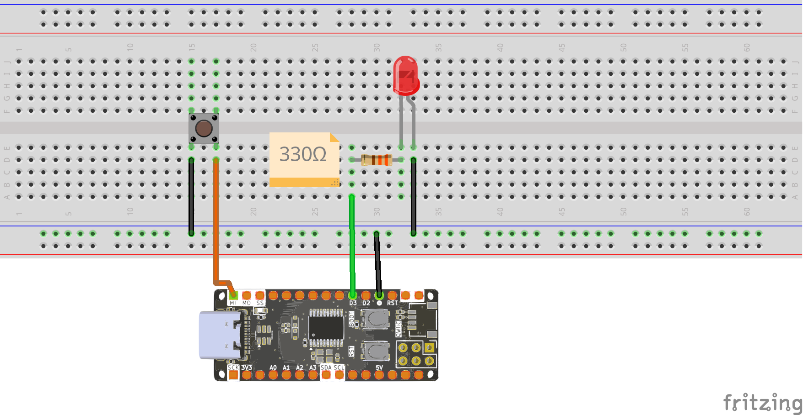

<br>
<br>
<br>

# Điều khiển đèn LED bằng nút bấm

## 1. Giới Thiệu

> Bài viết này hướng dẫn cách sử dụng nút bấm với Zerobase để điều khiển LED hoặc thực hiện các tác vụ khác.

## 2. Chuẩn Bị

- Zerobase
- Nút bấm (Button)
- Dây nối
- Điện trở 330Ω
- LED (tuỳ chọn)

## 3. Nguyên Lý Hoạt Động

Nút bấm hoạt động như một công tắc đóng/mở. Trong hướng dẫn này, chúng ta sẽ sử dụng điện trở kéo lên nội bộ của vi điều khiển, do đó không cần mắc thêm điện trở bên ngoài.

Khi nút không nhấn, chân tín hiệu ở mức HIGH. Khi nhấn, chân tín hiệu xuống LOW.

## 4. Sơ Đồ Kết Nối



## 5. Code Điều Khiển LED Bằng Nút Bấm

Dưới đây là ví dụ code để bật/tắt LED khi nhấn nút:

```cpp

#define btn = 12;
#define led = 3;

// the setup function runs once when you press reset or power the board
void setup() {
  // initialize digital pin LED_BUILTIN as an output.
  pinMode(btn, INPUT_PULLUP);
  pinMode(led, OUTPUT);
}

// the loop function runs over and over again forever
void loop() {
  if (digitalRead(btn)) {
    digitalWrite(led, LOW);
  } else {
    digitalWrite(led, HIGH);
  }
}
```

## 6. Lưu Ý

!> Nếu nút bấm không hoạt động đúng, kiểm tra lại kết nối.

!> Sử dụng `INPUT_PULLUP` giúp đơn giản hóa mạch bằng cách dùng điện trở kéo lên nội bộ của vi điều khiển.

**Chúc bạn thành công!**

