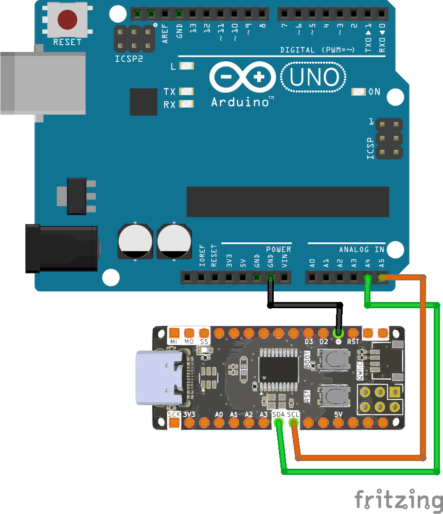

<br>
<br>
<br>

# Giao Tiếp I2C Giữa Zerobase Và Arduino Uno

## 1. Giới Thiệu

> Bài viết này hướng dẫn cách thiết lập giao tiếp I2C giữa board Zerobase và Arduino Uno, trong đó Zerobase sẽ đóng vai trò **Master** và Arduino Uno sẽ đóng vai trò **Slave**.

## 2. Chuẩn Bị

- Board **Zerobase** (Master)
- Board **Arduino Uno** (Slave)
- Dây nối

## 3. Sơ Đồ Kết Nối

Kết nối các chân I2C giữa hai board:

| Zerobase (Master) | Arduino Uno (Slave) |
|-------------------|---------------------|
| SDA (18)        | SDA (A4)            |
| SCL (19)        | SCL (A5)            |
| GND              | GND                 |

<br>



## 4. Code Master (Zerobase)

```cpp
#include <Wire.h>

void setup() {
  Wire.begin();           // Start as I2C master
  Wire.setClock(100000);  // Standard mode (100 kHz)
  Serial.begin(9600);
}

void loop() {
  Serial.println("Sending data to Arduino...");
  Wire.beginTransmission(8);
  Wire.write("Hello from Zerobase");  // Send data
  Wire.endTransmission();

  delay(1000);  // Wait 1 second before sending again
}
```

## 5. Code Slave (Arduino Uno)

```cpp
#include <Wire.h>

void setup() {
  Wire.begin(8); // Initialize as I2C slave with address 8
  Wire.onReceive(receiveEvent); // Register receive event
  Serial.begin(9600);
}

void loop() {
  // Do nothing, waiting for data from master
}

void receiveEvent(int howMany) {
  Serial.print("Received: ");
  while (Wire.available()) {
    char c = Wire.read(); // Read incoming byte
    Serial.print(c);
  }
  Serial.println();
}
```
## 6. Kiểm Tra Kết Nối

1. Mở Serial Monitor trên cả hai board.
2. Quan sát dữ liệu gửi từ Zerobase (**Master**) đến Arduino Uno (**Slave**).
3. Nếu không nhận được dữ liệu, kiểm tra lại dây kết nối hoặc địa chỉ I2C.

**Chúc bạn thành công!**

