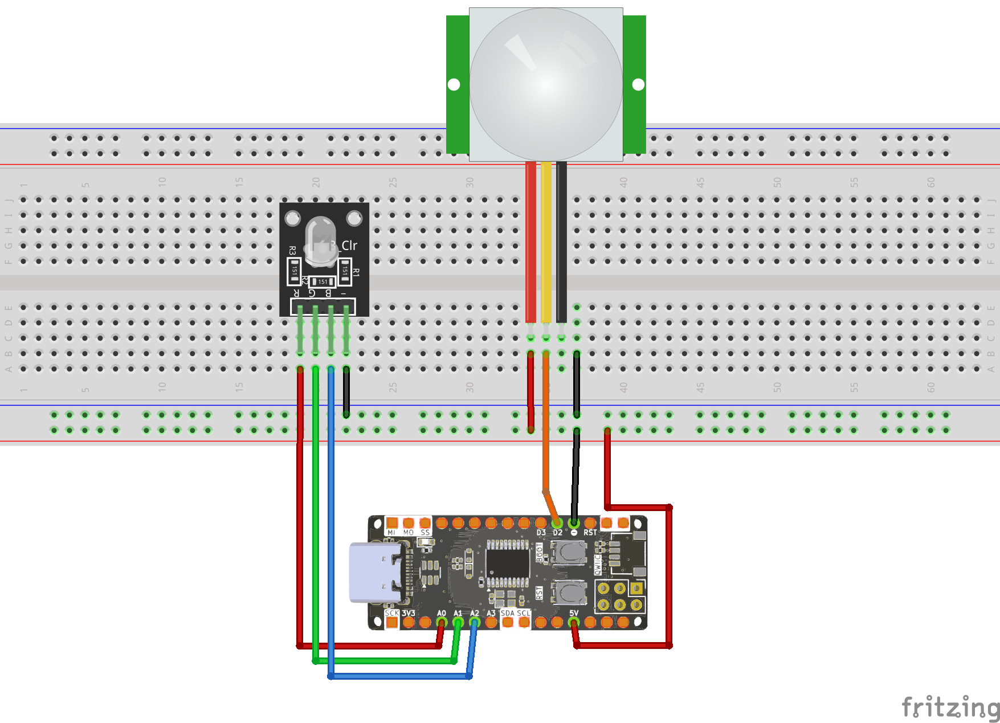
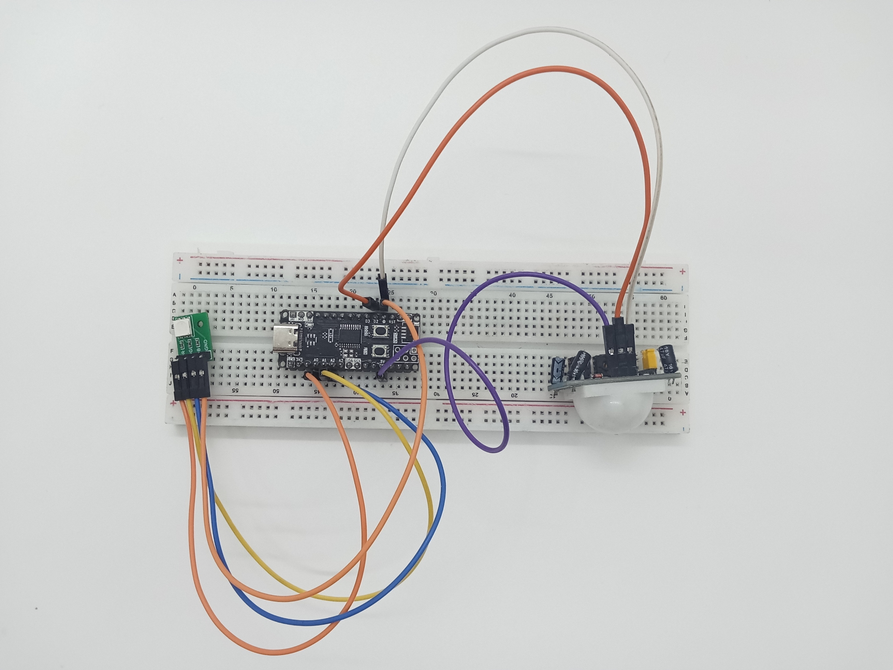

<br>
<br>
<br>

# Sử Dụng Cảm Biến PIR Với Zerobase

## 1. Giới Thiệu

> Bài viết này hướng dẫn cách sử dụng cảm biến **PIR** với board **Zerobase**, giúp phát hiện chuyển động và điều khiển LED RGB.

## 2. Chuẩn Bị

- Board **Zerobase**  
- Cảm biến **PIR**  
- Module LED **RGB**  
- Dây nối  

## 3. Sơ Đồ Kết Nối

| Zerobase | Cảm biến PIR | LED RGB |
|----------|-------------|---------|
| 2        | OUT         |         |
| 5V      | VCC         |         |
| GND      | GND         |         |
| 14       |             | Chân đỏ |
| 15       |             | Chân xanh lá |
| 16       |             | Chân xanh dương |

> **Lưu ý:** Một số module PIR cần thời gian khởi động khoảng **30 giây** sau khi cấp nguồn để ổn định.

<br>



## 4. Ảnh chụp mạch hoàn chỉnh

## 5. Code Điều Khiển PIR Với Zerobase

```cpp
#define PIR_PIN 2
#define RED_PIN 14
#define GREEN_PIN 15
#define BLUE_PIN 16

void setup() {
  pinMode(PIR_PIN, INPUT);
  Serial.begin(9600);
  pinMode(RED_PIN, OUTPUT);
  pinMode(GREEN_PIN, OUTPUT);
  pinMode(BLUE_PIN, OUTPUT);
}

void loop() {
  Serial.println(digitalRead(PIR_PIN));
  if (digitalRead(PIR_PIN) == 1) {
    digitalWrite(RED_PIN, HIGH);
    digitalWrite(GREEN_PIN, HIGH);
    digitalWrite(BLUE_PIN, HIGH);
    delay(200);
  }
  digitalWrite(RED_PIN, LOW);
  digitalWrite(GREEN_PIN, LOW);
  digitalWrite(BLUE_PIN, LOW);
}
```

## 6. Kiểm Tra Hoạt Động

1. Kết nối **Zerobase**, **cảm biến PIR** và **LED RGB** theo sơ đồ trên.
2. Mở **Serial Monitor** trong **Arduino IDE**.
3. Đặt baud rate **9600**.
4. Khi có chuyển động, LED RGB sẽ sáng lên trong **200ms** rồi tắt.
5. Nếu cảm biến không phản hồi, kiểm tra **dây nối** và thử lại.

**Chúc bạn thành công!**

