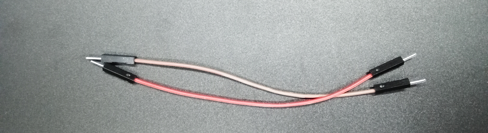
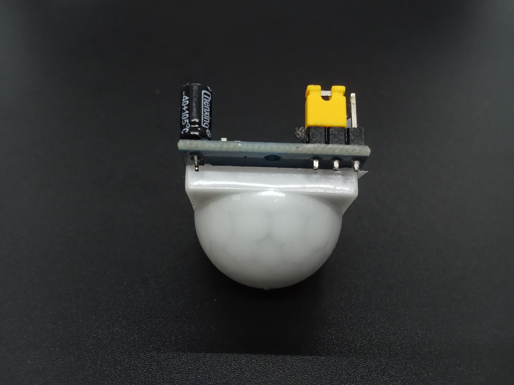
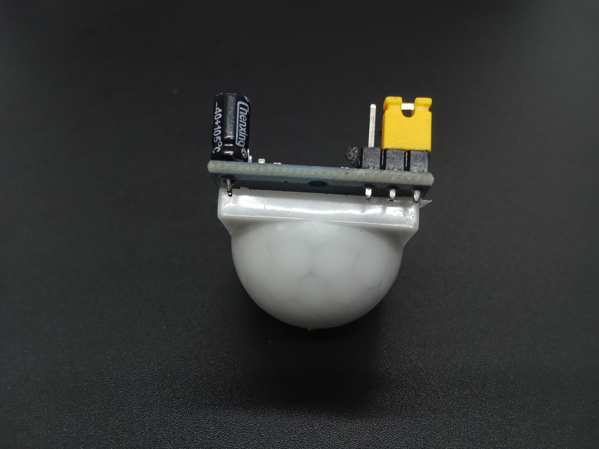
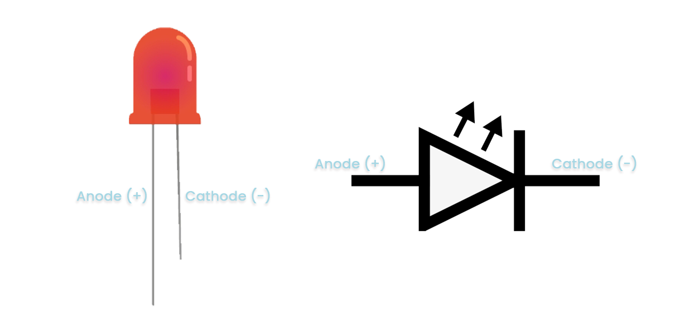
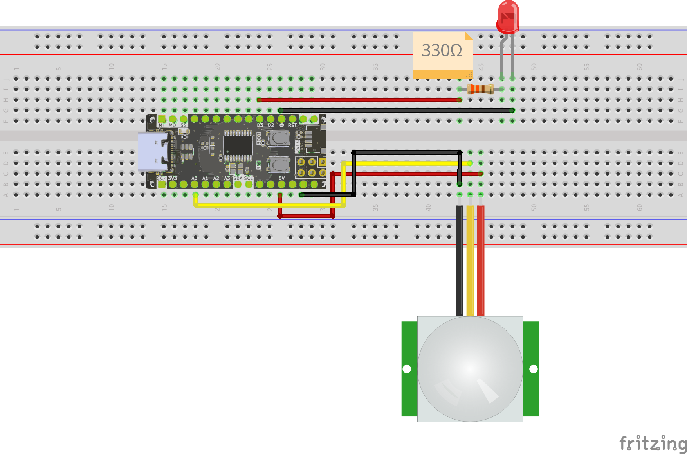
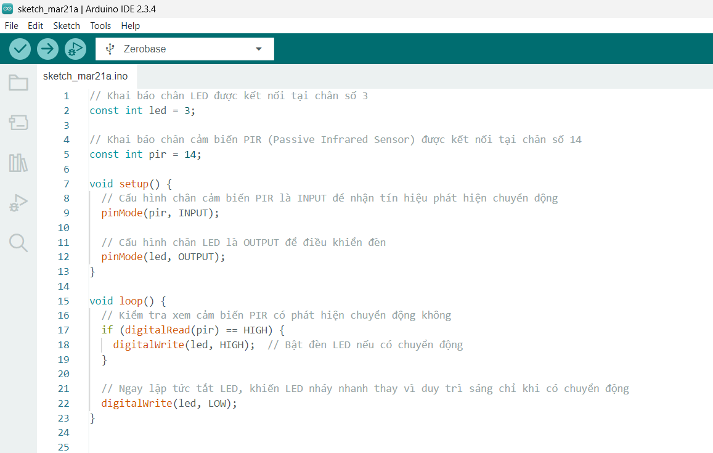

<br>
<br>
<br>

# Sử Dụng Cảm Biến PIR Với Zerobase


## Tổng quan

?> Bài viết này hướng dẫn cách sử dụng cảm biến PIR với board Zerobase, giúp phát hiện chuyển động và điều khiển LED.

## Chuẩn Bị

> Board Zerobase


> Cảm biến PIR 


> Điện trở 330Ω


> LED


> Dây nối



## Nguyên Lý Hoạt Động

### Cảm Biến PIR


Cảm biến PIR (Passive Infrared Sensor) là cảm biến hồng ngoại không tiếp xúc, dùng để phát hiện chuyển động.

Khi có chuyển động, cảm biến sẽ phát ra tín hiệu điện. Tín hiệu này có thể ở mức cao (1) hoặc thấp (0) tùy thuộc vào cách kết nối jumper trên cảm biến.

?> Cách kết nối jumper để tín hiệu ở mức cao (1) khi có chuyển động



?> Cách kết nối jumper để tín hiệu ở mức thấp (0) khi có chuyển động



### LED



LED (Light Emitting Diode) là một loại diode phát sáng. Khi có dòng điện chạy qua (từ cực Anode (+) sang cực Cathode (-)), nó phát ra ánh sáng. Để bảo vệ LED, cần mắc nối tiếp một điện trở để giảm dòng điện.

### Toàn mạch

Hướng dẫn này kết nối jumper của cảm biến PIR để tín hiệu ở mức cao khi có chuyển động.

Khi có chuyển động, cảm biến sẽ phát ra tín hiệu ở mức cao (1), điều này sẽ bật LED. 

Nếu không có chuyển động, cảm biến sẽ phát ra tín hiệu ở mức thấp (0), LED sẽ tắt.

## Các Chân Kết Nối


Sử dụng chân D3 để kết nối với điện trở 330ohm nối tiếp với cực Anode (+) của LED và GND để kết nối với cực Cathode (-) của LED.

Sử dụng chân 5V để kết nối với chân VCC cảm biến PIR, GND để kết nối với chân GND của cảm biến, chân A0 (D14) để kết nối với chân OUT cảm biến PIR

## Sơ Đồ Kết Nối



## Ảnh chụp mạch hoàn chỉnh


## Code Điều Khiển LED bằng PIR

```cpp
// Khai báo chân LED được kết nối tại chân số 3
const int led = 3;

// Khai báo chân cảm biến PIR (Passive Infrared Sensor) được kết nối tại chân số 14
const int pir = 14;

void setup() {
  // Cấu hình chân cảm biến PIR là INPUT để nhận tín hiệu phát hiện chuyển động
  pinMode(pir, INPUT);

  // Cấu hình chân LED là OUTPUT để điều khiển đèn
  pinMode(led, OUTPUT);
}

void loop() {
  // Kiểm tra xem cảm biến PIR có phát hiện chuyển động không
  if (digitalRead(pir) == HIGH) {
    digitalWrite(led, HIGH);  // Bật đèn LED nếu có chuyển động
  }

  // Ngay lập tức tắt LED, khiến LED nháy nhanh thay vì duy trì sáng chỉ khi có chuyển động
  digitalWrite(led, LOW);
}
```

Copy đoạn code trên và dán vào Arduino IDE, kết quả sẽ được như hình bên dưới.



## Giải Thích Code

```cpp
const int led = 3;
const int pir = 14;
```

Khai báo biến `led` là chân số 3 kết nối với đèn LED và biến `pir` là chân số 14 kết nối với chân OUT cảm biến PIR.

```cpp
  pinMode(pir, INPUT);
  pinMode(led, OUTPUT);
```

Cấu hình chân `pir` là INPUT để nhận tín hiệu phát hiện chuyển động và chân `led` là OUTPUT để điều khiển đèn LED.

```cpp
  if (digitalRead(pir) == HIGH) {
    digitalWrite(led, HIGH);
  }
```

Trong hàm `loop()`, chúng ta kiểm tra xem cảm biến PIR có phát hiện chuyển động không. Nếu có chuyển động (mức cao hoặc 1), đèn LED sẽ bật.

```cpp
  digitalWrite(led, LOW);
```

Ngay lập tức tắt LED, khiến LED nháy nhanh thay vì duy trì sáng chỉ khi có chuyển động.

## Thực hiện nạp code

Cuối cùng bạn thực hiện nạp code vào board Zerobase. Nếu chưa biết cách nạp code cho Zerobase, bạn có thể tham khảo [tại đây](https://zerobase.chipstack.vn/#/vi/zerobase/quickstart).

Nếu muốn thay đổi chân kết nối, bạn chỉ cần sửa lại giá trị biến `led` hoặc `pir` trong code sau đó kết nối đèn LED và cảm biến PIR với chân tương ứng.

```cpp
const int led = 3; // Thay đổi chân đèn LED
const int pir = 14; // Thay đổi chân cảm biến PIR
```

## Kết quả

?> Khi có chuyển động, đèn LED sẽ bật. Nếu không có chuyển động, đèn LED sẽ tắt.

<p align="center">
  
</p>

## Kết luận và Hướng phát triển

Bài viết đã hướng dẫn cách sử dụng cảm biến PIR để phát hiện chuyển động và điều khiển đèn LED trên board Zerobase. Đây là bước khởi đầu giúp bạn làm quen với lập trình vi điều khiển và cách điều khiển thiết bị ngoại vi.

Để phát triển thêm từ bài học này, bạn có thể thử các ý tưởng sau:

- **Điều khiển cảm biến PIR bằng nút nhấn:** Sử dụng nút nhấn để bật/tắt cảm biến PIR hoặc thay đổi cách phát hiện chuyển động.
- **Điều khiển LED RGB bằng cảm biến PIR:** Sử dụng cảm biến PIR để điều khiển đổi màu LED RGB.
- **Gửi thông báo qua Telegram khi có chuyển động:** Sử dụng cảm biến PIR để phát hiện chuyển động và gửi thông báo qua Telegram.
- **Sử dụng còi báo khi có chuyển động:** Sử dụng cảm biến PIR để phát hiện chuyển động và kích hoạt còi báo.

Với những ý tưởng trên, bạn sẽ có cơ hội thực hành và nâng cao kỹ năng lập trình vi điều khiển.

**Chúc bạn thành công!**

