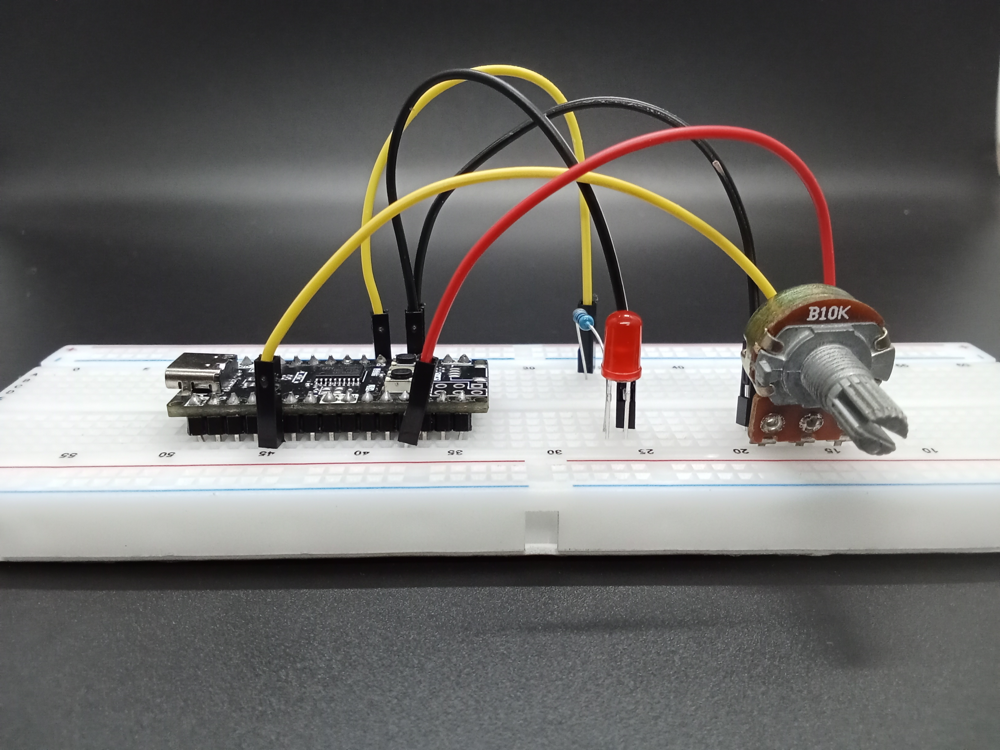
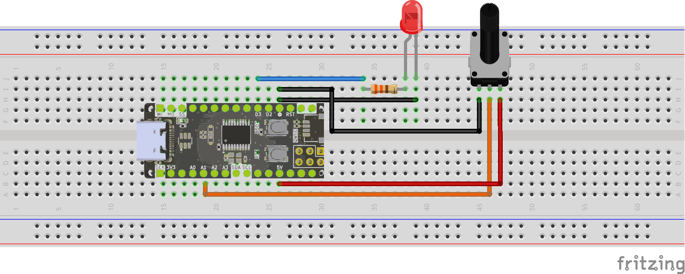
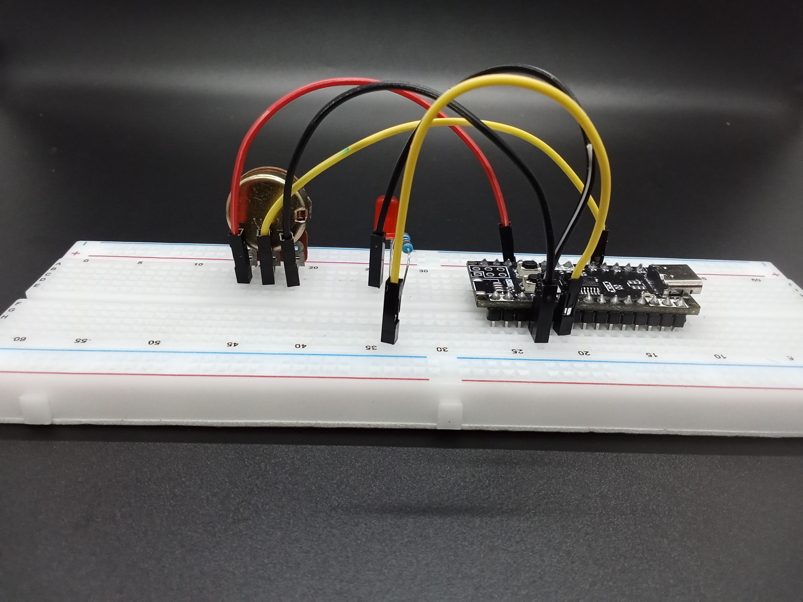
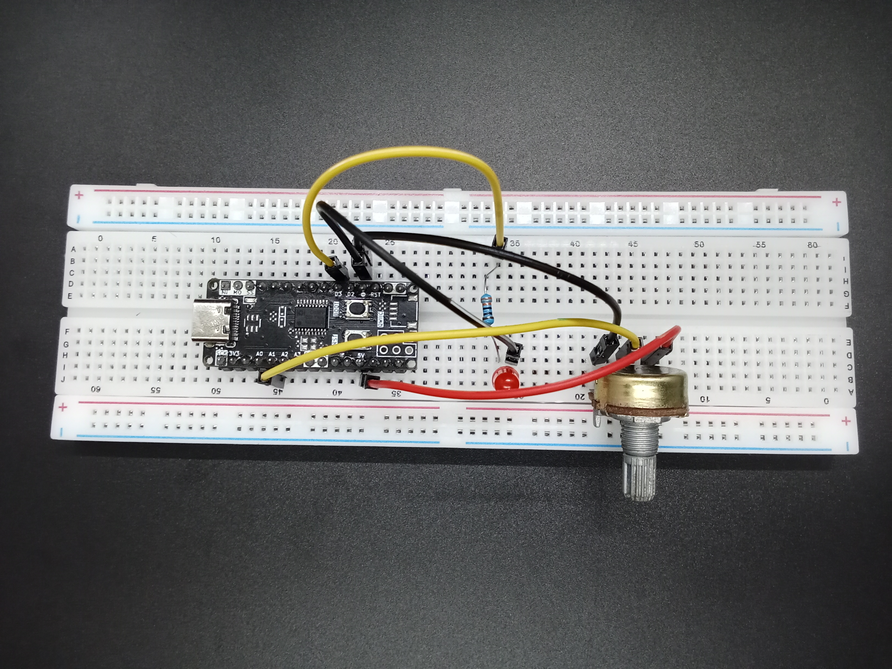
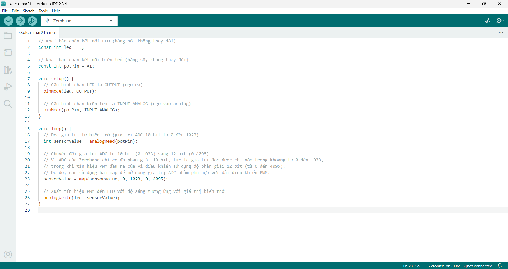

<br>
<br>
<br>

# Sử Dụng Biến Trở Điều Chỉnh Độ Sáng LED Với Zerobase



## Tổng quan

?> Bài viết này hướng dẫn sử dụng biến trở để điều chỉnh độ sáng của LED với Zerobase.

## Chuẩn bị

| Linh kiện |  Link mua |
| --- | --- |
| Board Zerobase | [Mua ngay](https://chipstack.vn/san-pham/zerobase/) |
| Biến trở 10kΩ | [Mua ngay](https://chipstack.vn/san-pham/bien-tro-wh148-3-chan-truc-15mm/) |
| Điện trở 330Ω | [Mua ngay](https://chipstack.vn/san-pham/dien-tro-1-4w-1/) |
| LED | [Mua ngay](https://chipstack.vn/san-pham/led-5mm-vo-mau/) |
| Dây nối | [Mua ngay](https://chipstack.vn/san-pham/day-jumper-duc-duc/) |

<br>

<div align="center">
    
    <p><em>Board Zerobase</em></p>
</div>

<br>

<div align="center">
    
    <p><em>Biến trở 10kΩ</em></p>
</div>

<br>

<div align="center">
    
    <p><em>Điện trở 330Ω</em></p>
</div>

<br>

<div align="center">
    
    <p><em>LED</em></p>
</div>

<br>

<div align="center">
    
    <p><em>Dây nối</em></p>
</div>


## Nguyên lý hoạt động

?> Khi xoay biến trở, độ sáng của LED sẽ thay đổi tùy theo giá trị điện áp tại chân giữa của biến trở.

> Xem thêm về biến trở [tại đây](https://chipstack.vn/kien-thuc/dien-tu-co-ban/cau-tao-va-cach-mac-bien-tro-3-chan-chi-tiet-de-hieu/).

> Xem thêm về LED [tại đây](https://chipstack.vn/uncategorized/diot-phat-quang-la-gi-nguyen-ly-hoat-dong-va-ung-dung-tiet-kiem-nang-luong/).

## Sơ đồ kết nối


Sử dụng chân A1 của Zerobase để kết nối với chân 2 của biến trở. Chân 1 được nối với GND, chân 3 được nối với VCC.

Sử dụng chân D3 của Zerobase để kết nối với cực anode (+) của LED. Cực cathode (-) của LED được nối với GND của Zerobase.








## Code

```cpp
// Khai báo chân kết nối LED (hằng số, không thay đổi)
const int led = 3;

// Khai báo chân kết nối biến trở (hằng số, không thay đổi)
const int potPin = A1;

void setup() {
  // Cấu hình chân LED là OUTPUT (ngõ ra)
  pinMode(led, OUTPUT);

  // Cấu hình chân biến trở là INPUT_ANALOG (ngõ vào analog)
  pinMode(potPin, INPUT_ANALOG);
}

void loop() {
  // Đọc giá trị từ biến trở (giá trị ADC 10 bit từ 0 đến 1023)
  int sensorValue = analogRead(potPin);

  // Chuyển đổi giá trị ADC từ 10 bit (0-1023) sang 12 bit (0-4095)
  // Vì ADC của Zerobase chỉ có độ phân giải 10 bit, tức là giá trị đọc được chỉ nằm trong khoảng từ 0 đến 1023,
  // trong khi tín hiệu PWM đầu ra của vi điều khiển sử dụng độ phân giải 12 bit (từ 0 đến 4095).
  // Do đó, cần sử dụng hàm map để mở rộng giá trị ADC nhằm phù hợp với dải điều khiển PWM.
  sensorValue = map(sensorValue, 0, 1023, 0, 4095);

  // Xuất tín hiệu PWM đến LED với độ sáng tương ứng với giá trị biến trở
  analogWrite(led, sensorValue);
}
```

Copy đoạn code trên và dán vào Arduino IDE, kết quả sẽ được như hình bên dưới.



### Biên dịch

Nhấn vào biểu tượng Verify để biên dịch code.


### Thực hiện nạp code

Cuối cùng bạn thực hiện nạp code vào board Zerobase. Nếu chưa biết cách nạp code cho Zerobase, bạn có thể tham khảo [tại đây](https://zerobase.chipstack.vn/#/vi/zerobase/quickstart).

Nếu muốn thay đổi chân kết nối, bạn chỉ cần sửa lại giá trị của biến `led` hoặc `potPin` sau đó kết nối LED và biến trở với chân tương ứng.

```cpp
const int led = 3; // Thay đổi chân kết nối LED
const int potPin = A1; // Thay đổi chân kết nối biến trở
```

### Giải thích code

Khai báo chân kết nối LED và biến trở.

```cpp
const int led = 3;
const int potPin = A1;
```

Cấu hình chân LED là OUTPUT và chân biến trở là INPUT_ANALOG.

```cpp
pinMode(led, OUTPUT);
pinMode(potPin, INPUT_ANALOG);
```

Đọc giá trị từ biến trở (ADC 10 bit từ 0 đến 1023).

```cpp
int sensorValue = analogRead(potPin);
```

Vì ADC của Zerobase chỉ có độ phân giải 10 bit, cần sử dụng hàm map để mở rộng giá trị ADC từ 10 bit (0-1023) sang 12 bit (0-4095) để phù hợp với dải điều khiển PWM.

```cpp
sensorValue = map(sensorValue, 0, 1023, 0, 4095);
```

Xuất tín hiệu PWM đến LED với độ sáng tương ứng với giá trị biến trở.

```cpp
analogWrite(led, sensorValue);
```

## Kết quả

?> Sau khi nạp code thành công, bạn sẽ thấy LED sáng lên và độ sáng của LED sẽ thay đổi tùy theo vị trí của trục xoay của biến trở.

<p align="center">
  
</p>

## Kết luận và hướng phát triển

Bài viết đã hướng dẫn cách sử dụng biến trở để điều chỉnh độ sáng của LED với vi điều khiển Zerobase, thông qua việc đọc tín hiệu từ biến trở và điều khiển cường độ PWM. Đây là một ứng dụng cơ bản nhưng rất hữu ích trong điều khiển điện tử.

Để phát triển thêm từ bài học này, bạn có thể thử các ý tưởng sau:

- Sử dụng biến trở để điều chỉnh tốc độ quay của động cơ: Thay vì điều khiển LED, bạn có thể dùng biến trở để thay đổi tốc độ quay của động cơ DC hoặc động cơ servo bằng cách điều chỉnh giá trị PWM.
- Sử dụng biến trở để điều chỉnh độ nhạy của một cảm biến: Trong một số ứng dụng, bạn có thể dùng biến trở để tinh chỉnh độ nhạy của cảm biến ánh sáng (LDR), cảm biến nhiệt độ hoặc cảm biến siêu âm bằng cách thay đổi điện áp tham chiếu.
- Kết nối biến trở với màn hình LCD để hiển thị giá trị điện áp hoặc thông số điều chỉnh.

**Chúc bạn thành công!** <span style="float: right;">[Các ví dụ khác](vi/zerobase/examples.md)</span>

