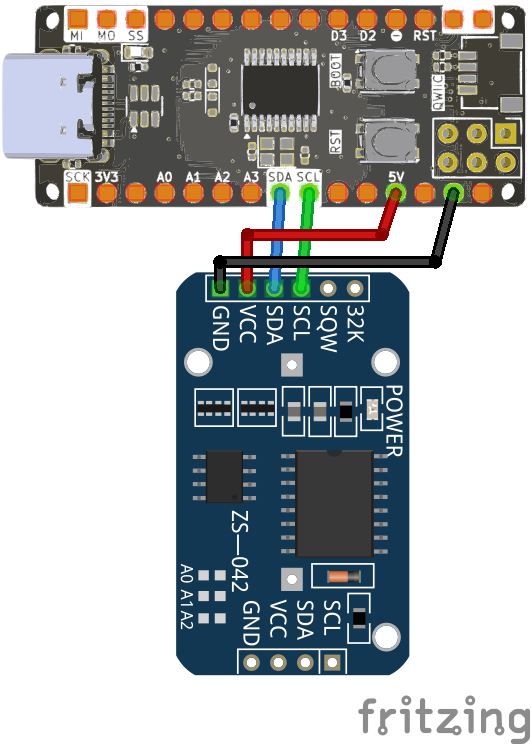
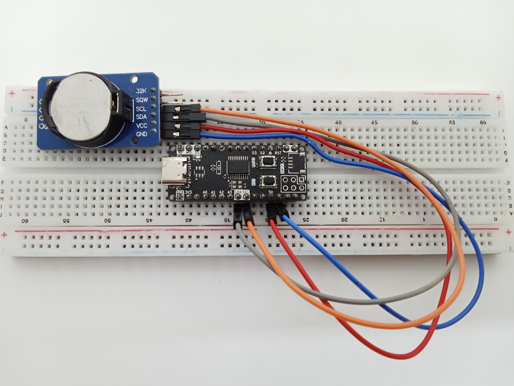

<br>
<br>
<br>

# Sử Dụng Module Thời GIan Thực RTC DS3231 Với Zerobase

## 1. Giới Thiệu

> Bài viết này hướng dẫn cách sử dụng **module thời gian thực RTC DS3231** với board **Zerobase** để lấy thời gian thực.

## 2. Chuẩn Bị

- Board **Zerobase**  
- Module **RTC DS3231**  
- Dây nối  

## 3. Cài Đặt Thư Viện

Để sử dụng **RTC DS3231**, bạn cần cài đặt thư viện hỗ trợ. 

1. Truy cập [GitHub DS3231 Library](https://github.com/NorthernWidget/DS3231).
2. Tải về và giải nén thư viện.
3. Mở **Arduino IDE**, vào **Sketch > Include Library > Add .ZIP Library...**.
4. Chọn file .zip vừa tải về để cài đặt thư viện.

## 4. Sơ Đồ Kết Nối

| Zerobase | RTC DS3231 |
|----------|-----------|
| SDA (18) | SDA |
| SCL (19) | SCL |
| 5V       | VCC |
| GND       | GND |

?> **Lưu ý:** DS3231 có pin backup để duy trì thời gian ngay cả khi mất nguồn.

<br>



## 5. Ảnh chụp mạch hoàn chỉnh



## 5. Code Đọc Thời Gian Từ RTC

```cpp
#include <Wire.h>
#include <DS3231.h>

RTClib myRTC;

void setup() {
  Serial.begin(57600);
  Wire.begin();
  delay(500);
  Serial.println("Zerobase Ready!");
}

void loop() {
  delay(1000);
  DateTime now = myRTC.now();

  Serial.print(now.year(), DEC);
  Serial.print('/');
  Serial.print(now.month(), DEC);
  Serial.print('/');
  Serial.print(now.day(), DEC);
  Serial.print(' ');
  Serial.print(now.hour(), DEC);
  Serial.print(':');
  Serial.print(now.minute(), DEC);
  Serial.print(':');
  Serial.print(now.second(), DEC);
  Serial.println();
}
```

## 6. Kiểm Tra Hoạt Động

1. Kết nối **Zerobase** và **RTC DS3231** theo sơ đồ trên.
2. Nạp code vào **Zerobase**.
3. Mở **Serial Monitor**, đặt baud rate **57600**.
4. Quan sát thời gian thực được hiển thị.
5. Nếu không hiển thị đúng, kiểm tra **kết nối I2C**.

**Chúc bạn thành công!**

