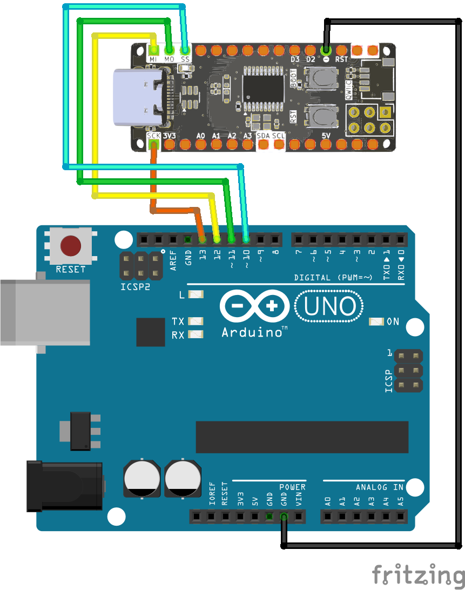

<br>
<br>
<br>

# Giao Tiếp SPI Giữa Zerobase Và Arduino Uno

## 1. Giới Thiệu

> Bài viết này hướng dẫn cách thiết lập giao tiếp SPI giữa board **Zerobase** (custom board) và **Arduino Uno**, trong đó **Zerobase** sẽ đóng vai trò **Master** và **Arduino Uno** sẽ đóng vai trò **Slave**.

## 2. Chuẩn Bị

- Board **Zerobase** (Master)
- Board **Arduino Uno** (Slave)
- Dây nối

## 3. Sơ Đồ Kết Nối

Kết nối các chân SPI giữa hai board:

| Zerobase (Master) | Arduino Uno (Slave) |
|-------------------|---------------------|
| SCK (13)        | SCK (13)            |
| MISO (12)       | MISO (12)           |
| MOSI (11)       | MOSI (11)           |
| SS (10)         | SS (10)             |
| GND              | GND                 |



## 4. Code Master (Zerobase)

```cpp
#include <SPI.h>
#include <SPI.h>

void setup() {
  pinMode(SS, OUTPUT);
  digitalWrite(SS, HIGH);  // Deselect slave
  SPI.begin();
  Serial.begin(9600);
}

void loop() {
  const char* sentString = "Hello World";  // String to send (11 characters)
  char receivedString[12] = { 0 };         // Buffer for received string (+1 for null terminator)

  SPI.beginTransaction(SPISettings(1000000, MSBFIRST, SPI_MODE0));
  digitalWrite(SS, LOW);   // Select slave
  delayMicroseconds(100);  // Allow slave to prepare

  // Send and receive each character
  for (int i = 0; i < 11; i++) {
    receivedString[i] = SPI.transfer(sentString[i]);
    delayMicroseconds(200);  // Allow slave to process
  }

  digitalWrite(SS, HIGH);  // Deselect slave
  SPI.endTransaction();

  receivedString[11] = '\0';  // Null-terminate the received string

  // Debugging
  Serial.print("String sent: ");
  Serial.println(sentString);

  Serial.print("String received: ");
  Serial.println(receivedString);
  Serial.println();

  delay(1000);
}

```

## 5. Code Slave (Arduino Uno)

```cpp
#include <SPI.h>
#define SPI_SCK 13
#define SPI_MISO 12
#define SPI_MOSI 11
#define SPI_SS 10

void SPI_SlaveInit() {
  pinMode(SCK, INPUT);
  pinMode(MOSI, INPUT);
  pinMode(MISO, OUTPUT);
  pinMode(SS, INPUT);
  SPCR = (1 << SPE);  // Enable SPI in Slave mode
}

uint8_t SPI_SlaveReceive() {
  while (!(SPSR & (1 << SPIF)))
    ;  // Wait for reception to complete
  return SPDR;
}

void setup() {
  Serial.begin(9600);
  SPI_SlaveInit();
  Serial.println("Slave Initialized");
}

void loop() {
  char receivedString[12] = {0};  // Buffer for received string (+1 for null terminator)
  const char* responseString = "HELLO WORLD";  // Response string (11 characters)

  // Wait for SS to go LOW
  while (digitalRead(SS))
    ;

  // Synchronize with master: Initialize response for first byte
  SPDR = responseString[0];

  // Receive and respond to each character
  for (int i = 0; i < 11; i++) {
    receivedString[i] = SPI_SlaveReceive();  // Read incoming byte
    // if (i < 10) {
      SPDR = responseString[i + 1];  // Preload next response byte
    // }
  }

  receivedString[11] = '\0';  // Null-terminate the received string

  // Wait for SS to go HIGH
  while (!digitalRead(SS))
    ;

  // Debugging
  Serial.print("String received from master: ");
  Serial.println(receivedString);

  Serial.print("String response sent to master: ");
  Serial.println(responseString);
  Serial.println();
}

```

## 6. Kiểm Tra Kết Nối

1. Mở **Serial Monitor** trên cả hai board.
2. Quan sát dữ liệu gửi từ **Zerobase (Master)** đến **Arduino Uno (Slave)**.
3. Nếu không nhận được dữ liệu, kiểm tra lại dây kết nối hoặc chế độ SPI.

**Chúc bạn thành công!**

