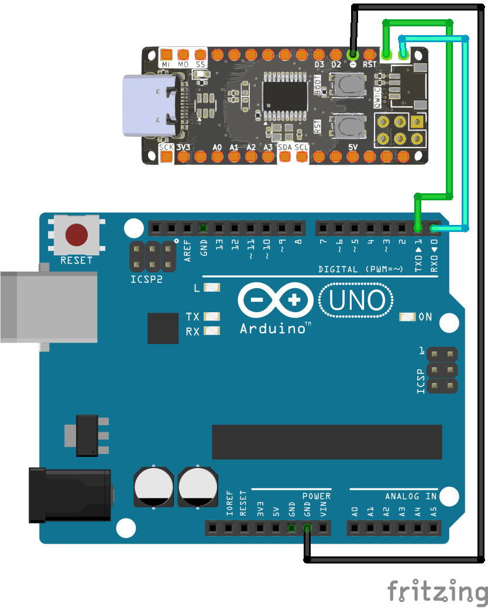

<br>
<br>
<br>

# Giao Tiếp UART Giữa Zerobase Và Arduino Uno

## 1. Giới Thiệu

> Bài viết này hướng dẫn cách thiết lập giao tiếp **UART** giữa board **Zerobase** (custom board) và **Arduino Uno**, giúp hai thiết bị có thể truyền nhận dữ liệu qua cổng serial.

## 2. Chuẩn Bị

- Board **Zerobase**
- Board **Arduino Uno**
- Dây nối

## 3. Sơ Đồ Kết Nối

Kết nối các chân UART giữa hai board:

| Zerobase (TX) | Arduino Uno (RX) |
|--------------|-----------------|
| TX (PA9)    | RX (0)          |
| RX (PA10)   | TX (1)          |
| GND         | GND             |



## 4. Code Cho Zerobase (Gửi Dữ Liệu)

```cpp
void setup() {
  Serial.begin(9600);
  Serial1.begin(9600);
}

void loop() {
  // Send data
  Serial1.println("This is Serial 1");
  delay(1000);
}
```

## 5. Code Cho Arduino Uno (Nhận Dữ Liệu)

```cpp
void setup() {
  Serial.begin(9600);
}

void loop() {
  // Receive data
  if (Serial.available()) {
    String receivedData = Serial.readStringUntil('\n');  // Reads until newline character
    Serial.println(receivedData);
  }
  delay(1000);
}
```

## 6. Kiểm Tra Kết Nối

1. Mở **Serial Monitor** trên Arduino IDE.
2. Đặt **baud rate** thành **9600**.
3. Quan sát dữ liệu được truyền từ **Zerobase** đến **Arduino Uno**.
4. Nếu không nhận được dữ liệu, kiểm tra lại **kết nối dây TX/RX** hoặc mức điện áp.

**Chúc bạn thành công!**

