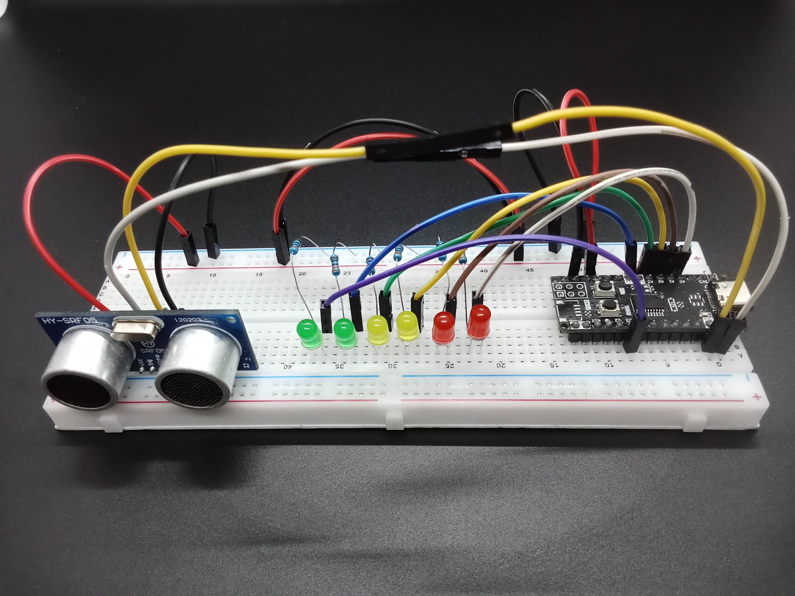
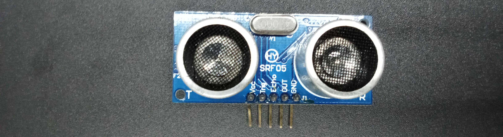
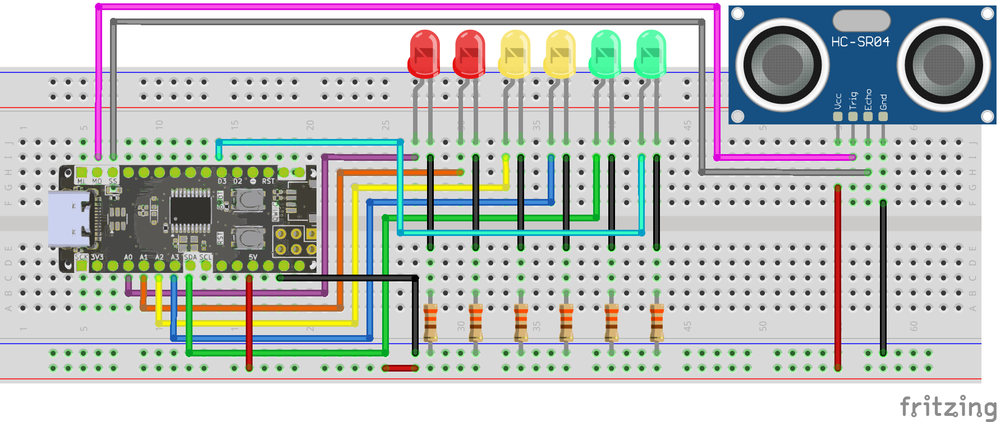
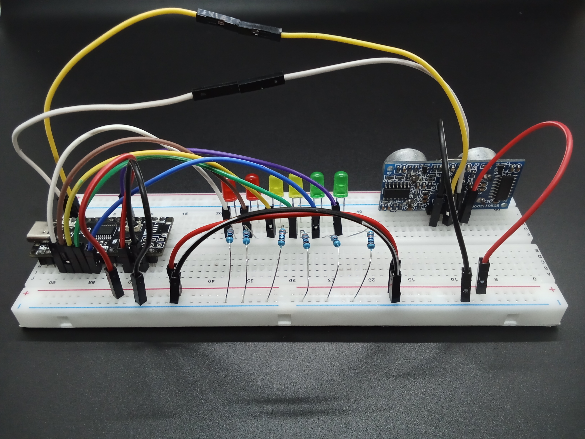
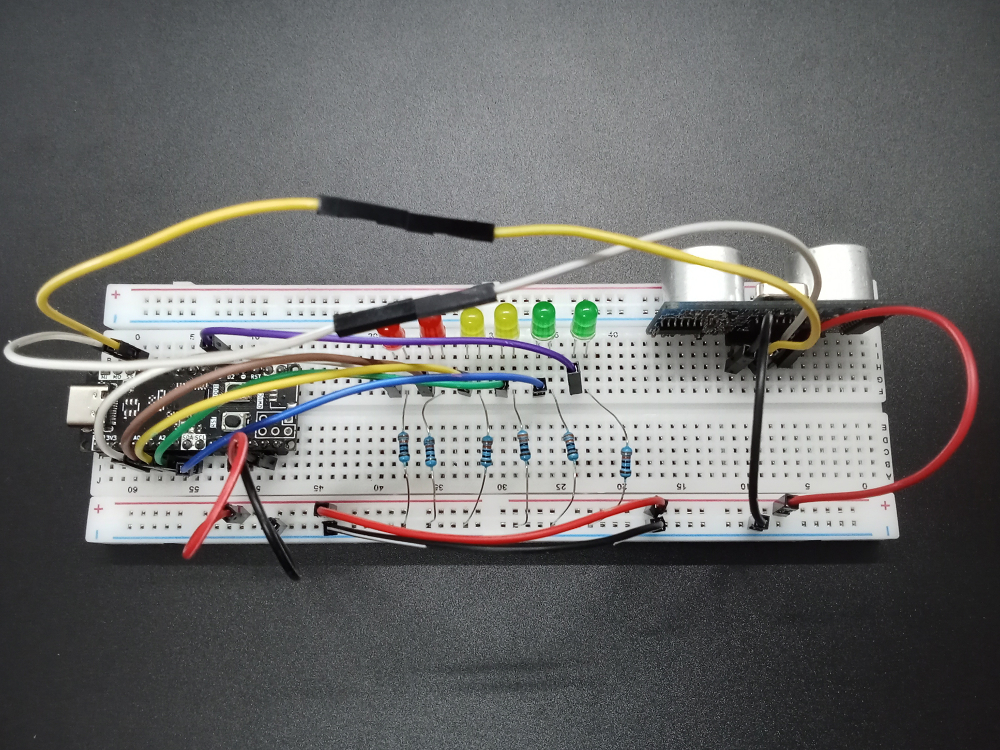
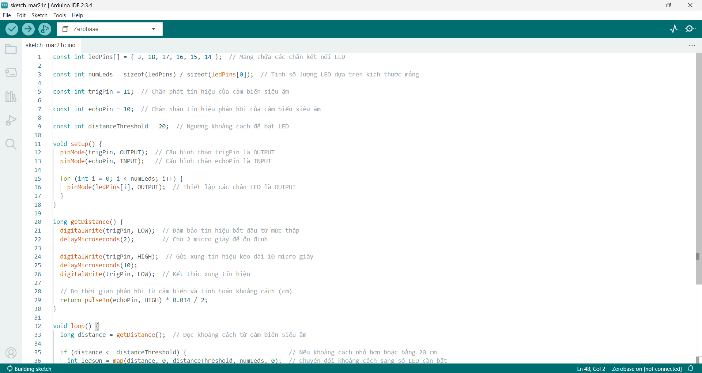

<br>
<br>
<br>

# Sử Dụng Cảm Biến Siêu Âm Với Zerobase



## Giới Thiệu

?> Bài viết này hướng dẫn sử dụng cảm biến siêu âm với Zerobase để đo khoảng cách và hiển thị kết quả bằng cách bật/tắt dãy LED. 

## Chuẩn Bị

> Board Zerobase


> Cảm biến siêu âm



> Điện trở 330Ω


> LED


> Dây nối


## Nguyên Lý Hoạt Động

### Cảm Biến Siêu Âm


Cảm biến siêu âm hoạt động dựa trên nguyên lý sóng siêu âm. 

Khi phát ra xung siêu âm qua chân Trig, cảm biến đo thời gian từ lúc phát tín hiệu đến lúc nhận được tín hiệu phản hồi qua chân Echo. 

Dựa vào thời gian này, ta có thể tính toán khoảng cách từ cảm biến đến vật cản.

### LED


LED (Light Emitting Diode) là một loại diode phát sáng. Khi có dòng điện chạy qua (từ cực Anode (+) sang cực Cathode (-)), nó phát ra ánh sáng.

Để bảo vệ LED, cần mắc nối tiếp một điện trở để giảm dòng điện.

### Toàn Mạch

Khi có vật ở gần, nhiều LED sáng hơn, và khi vật ở xa, ít LED sáng hơn.

## Các chân kết nối


Sử dụng chân A0 (D14), A1 (D15), A2 (D16), A3 (D17), SDA (D18) và D3 để kết nối với các chân anode (+) của LED, chân cathode (-) của LED kết nối với điện trở 330Ω và nối xuống GND của Zerobase.

Chân Trig của cảm biến siêu âm kết nối với chân MO (D11), chân Echo kết nối với chân SS (D10).

Sử dụng chân GND và 5V để cấp nguồn cho cảm biến siêu âm.

## Sơ Đồ Kết Nối



## Ảnh chụp mạch hoàn chỉnh






## Code Điều Khiển Cảm Biến Siêu Âm

```cpp
const int ledPins[] = { 3, 18, 17, 16, 15, 14 };  // Mảng chứa các chân kết nối LED

const int numLeds = sizeof(ledPins) / sizeof(ledPins[0]);  // Tính số lượng LED dựa trên kích thước mảng

const int trigPin = 11;  // Chân phát tín hiệu của cảm biến siêu âm

const int echoPin = 10;  // Chân nhận tín hiệu phản hồi của cảm biến siêu âm

const int distanceThreshold = 20;  // Ngưỡng khoảng cách để bật LED

void setup() {
  pinMode(trigPin, OUTPUT);  // Cấu hình chân trigPin là OUTPUT
  pinMode(echoPin, INPUT);   // Cấu hình chân echoPin là INPUT

  for (int i = 0; i < numLeds; i++) {
    pinMode(ledPins[i], OUTPUT);  // Thiết lập các chân LED là OUTPUT
  }
}

long getDistance() {
  digitalWrite(trigPin, LOW);  // Đảm bảo tín hiệu bắt đầu từ mức thấp
  delayMicroseconds(2);        // Chờ 2 micro giây để ổn định

  digitalWrite(trigPin, HIGH);  // Gửi xung tín hiệu kéo dài 10 micro giây
  delayMicroseconds(10);
  digitalWrite(trigPin, LOW);  // Kết thúc xung tín hiệu

  // Đo thời gian phản hồi từ cảm biến và tính toán khoảng cách (cm)
  return pulseIn(echoPin, HIGH) * 0.034 / 2;
}

void loop() {
  long distance = getDistance();  // Đọc khoảng cách từ cảm biến siêu âm

  if (distance <= distanceThreshold) {                             // Nếu khoảng cách nhỏ hơn hoặc bằng 20 cm
    int ledsOn = map(distance, 0, distanceThreshold, numLeds, 0);  // Chuyển đổi khoảng cách sang số LED cần bật
    ledsOn = constrain(ledsOn, 0, numLeds);         // Giới hạn giá trị trong khoảng hợp lệ

    for (int i = 0; i < numLeds; i++) {
      digitalWrite(ledPins[i], i < ledsOn ? HIGH : LOW);  // Bật số LED tương ứng với khoảng cách
    }
    delay(100);  // Giữ trạng thái LED trong 100ms
  }

  for (int i = 0; i < numLeds; i++) {
    digitalWrite(ledPins[i], LOW);  // Tắt tất cả LED khi không có vật trong phạm vi
  }
}
```
Copy đoạn code trên và dán vào Arduino IDE, kết quả sẽ được như hình bên dưới.




## Giải Thích Code

Khai báo mảng `ledPins` chứa các chân kết nối LED.

```cpp
const int ledPins[] = { 3, 18, 17, 16, 15, 14 };
```
Tính số lượng LED dựa trên kích thước mảng.

```cpp
const int numLeds = sizeof(ledPins) / sizeof(ledPins[0]);
```

Khai báo chân `trigPin` là chân phát tín hiệu của cảm biến siêu âm và chân `echoPin` là chân nhận tín hiệu phản hồi của cảm biến siêu âm.

```cpp
const int trigPin = 11;
const int echoPin = 10;
```

Khai báo ngưỡng khoảng cách để bật LED.

```cpp
const int distanceThreshold = 20;  // Ngưỡng khoảng cách để bật LED
```

Cấu hình chân `trigPin` là OUTPUT, chân `echoPin` là INPUT và cấu hình các chân LED là OUTPUT.

```cpp
  pinMode(trigPin, OUTPUT);
  pinMode(echoPin, INPUT);

  for (int i = 0; i < numLeds; i++) {
    pinMode(ledPins[i], OUTPUT);
  }
```

Hàm `getDistance()` dùng để đo khoảng cách từ cảm biến siêu âm.

```cpp
long getDistance() {
  digitalWrite(trigPin, LOW);
  delayMicroseconds(2);

  digitalWrite(trigPin, HIGH);
  delayMicroseconds(10);
  digitalWrite(trigPin, LOW);

  return pulseIn(echoPin, HIGH) * 0.034 / 2;
}
```

Đọc khoảng cách từ cảm biến siêu âm.

```cpp
  long distance = getDistance();
```

Nếu khoảng cách nhỏ hơn hoặc bằng 20 cm:
- Hàm map(value, fromLow, fromHigh, toLow, toHigh) dùng để ánh xạ giá trị từ một khoảng sang một khoảng khác.
- Ở đây, distance (khoảng cách đo được) nằm trong khoảng 0-32 cm sẽ được ánh xạ sang số LED cần bật từ numLeds (6) đến 0.
- Khi distance = 0 cm (vật rất gần), tất cả numLeds LED (6 LED) sẽ sáng.
- Khi distance = 32 cm (xa hơn giới hạn), 0 LED sáng.

- Hàm constrain(value, min, max) dùng để giới hạn giá trị trong một khoảng hợp lệ.
- Ở đây, giá trị ledsOn sẽ được giới hạn trong khoảng 0-6.

Dùng vòng lặp để bật số LED tương ứng với khoảng cách:
- Nếu LED thứ i nhỏ hơn số LED cần bật, bật LED thứ i, ngược lại tắt LED thứ i.

```cpp
  if (distance <= distanceThreshold) {
    int ledsOn = map(distance, 0, distanceThreshold, numLeds, 0);
    ledsOn = constrain(ledsOn, 0, numLeds);

    for (int i = 0; i < numLeds; i++) {
      digitalWrite(ledPins[i], i < ledsOn ? HIGH : LOW);
    }
    delay(100);
  }
```

Tắt tất cả LED khi không có vật trong phạm vi 20 cm.

```cpp
  for (int i = 0; i < numLeds; i++) {
    digitalWrite(ledPins[i], LOW);
  }
```

## Thực Hiện Nạp Code

Cuối cùng bạn thực hiện nạp code vào board Zerobase. Nếu chưa biết cách nạp code cho Zerobase, bạn có thể tham khảo [tại đây](https://zerobase.chipstack.vn/#/vi/zerobase/quickstart).

Nếu muốn thay đổi chân kết nối, bạn chỉ cần sửa lại giá trị biến `ledPins`, `trigPin` hoặc `echoPin` trong code sau đó kết nối LED và cảm biến siêu âm với chân tương ứng.

```cpp
const int ledPins[] = { 3, 18, 17, 16, 15, 14 };  // Thay đổi chân kết nối LED
const int trigPin = 11;  // Thay đổi chân kết nối Trig
const int echoPin = 10;  // Thay đổi chân kết nối Echo
```

Nếu muốn thay đổi ngưỡng khoảng cách để bật LED, bạn chỉ cần sửa giá trị biến `distanceThreshold`.

```cpp
const int distanceThreshold = 20;  // Thay đổi ngưỡng khoảng cách để bật LED
```

## Kết quả

?> Khi có vật ở gần, nhiều LED sáng hơn, và khi vật ở xa, ít LED sáng hơn. Khi không có vật trong phạm vi 20 cm, tất cả LED sẽ tắt.

<p align="center">
  
</p>

## Kết Luận và Hướng Phát Triển

Bài viết đã hướng dẫn cách sử dụng cảm biến siêu âm với Zerobase để đo khoảng cách và hiển thị kết quả bằng cách bật/tắt dãy LED.

Để phát triển thêm từ bài học này, bạn có thể thử các ý tưởng sau:
- Hiển thị khoảng cách trên màn hình LCD/OLED: Thay vì chỉ dùng LED, bạn có thể kết hợp màn hình để hiển thị chính xác khoảng cách đo được.
- Cảnh báo bằng âm thanh: Thêm còi buzzer để phát âm thanh khi vật đến gần một mức nguy hiểm.
- Điều khiển động cơ: Ứng dụng vào robot tránh vật cản bằng cách sử dụng khoảng cách đo được để thay đổi hướng di chuyển.
- Kết nối với IoT: Gửi dữ liệu khoảng cách lên một hệ thống IoT để giám sát từ xa.

**Chúc bạn thành công!**