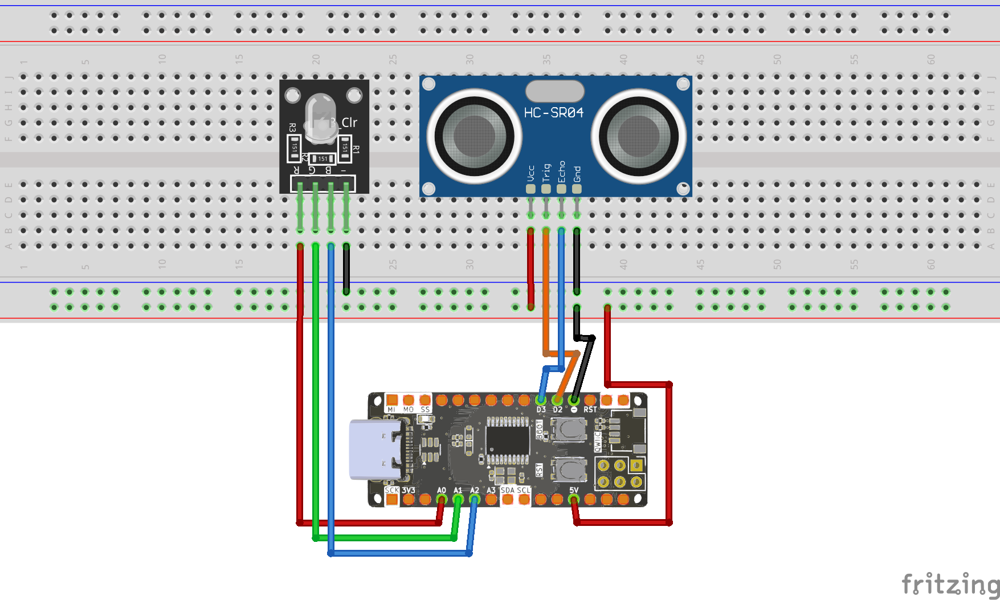
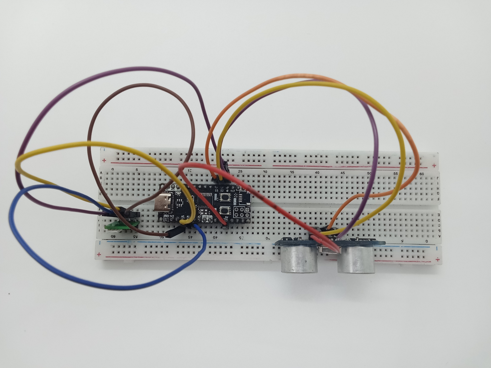
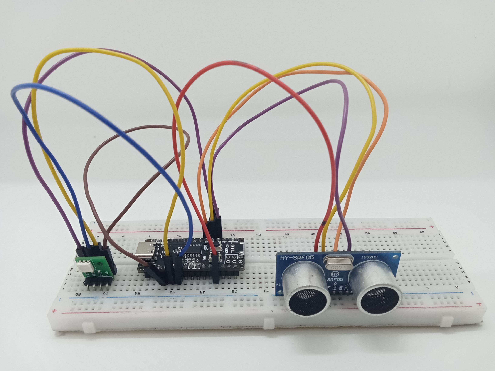

<br>
<br>
<br>

# Sử Dụng Cảm Biến Siêu Âm HC-SR04 Với Zerobase

## 1. Giới Thiệu

> Bài viết này hướng dẫn cách sử dụng **cảm biến siêu âm HC-SR04** với **Zerobase**, đồng thời hiển thị khoảng cách đo được và điều khiển LED cảnh báo bằng module LED RGB.

## 2. Chuẩn Bị

- Board **Zerobase**
- Cảm biến siêu âm **HC-SR04**
- Module **LED RGB**
- Dây nối

## 3. Sơ Đồ Kết Nối

| Zerobase | HC-SR04  | LED RGB |
|----------|---------|---------|
| D2       | Trig    |         |
| D3       | Echo    |         |
| D14      |         | Chân Đỏ |
| D15      |         | Chân Xanh Lá |
| D16      |         | Chân Xanh Dương |
| GND      | GND     | GND     |
| 5V       | VCC     | VCC     |



## 4. Ảnh chụp mạch hoàn chỉnh


<br>



## 5. Code Điều Khiển Cảm Biến Siêu Âm

```cpp
#define trigPin 2
#define echoPin 3
#define RED 14
#define GREEN 15
#define BLUE 16

int duration = 0;
int distance;

void setup() {
    Serial.begin(9600);
    pinMode(trigPin, OUTPUT);
    pinMode(echoPin, INPUT);
    pinMode(RED, OUTPUT);
    pinMode(GREEN, OUTPUT);
    pinMode(BLUE, OUTPUT);
}

void loop() {
    Serial.println("Hello World");
    
    // Gửi tín hiệu xung trigger
    duration = 0;
    digitalWrite(trigPin, LOW);
    delayMicroseconds(10);
    digitalWrite(trigPin, HIGH);
    delayMicroseconds(10);
    digitalWrite(trigPin, LOW);

    // Đọc tín hiệu phản hồi
    duration = pulseIn(echoPin, HIGH);
    Serial.print("Duration from pulseIn: ");
    Serial.println(duration);
    
    // Tính toán khoảng cách (cm)
    distance = ((duration / 2) * 0.0343);
    Serial.print("Distance: ");
    Serial.print(distance);
    Serial.println(" cm");

    // Điều khiển module LED RGB theo khoảng cách
    if (distance > 30) {
        digitalWrite(GREEN, HIGH);
        digitalWrite(BLUE, LOW);
        digitalWrite(RED, LOW);
    } else if (distance > 20) {
        digitalWrite(GREEN, LOW);
        digitalWrite(BLUE, HIGH);
        digitalWrite(RED, LOW);
    } else {
        digitalWrite(GREEN, LOW);
        digitalWrite(BLUE, LOW);
        digitalWrite(RED, HIGH);
    }
    
    delay(500);
}
```

## 6. Kiểm Tra Kết Nối

1. **Mở Serial Monitor** trên Arduino IDE, đặt baud rate **9600**.
2. Quan sát dữ liệu hiển thị khoảng cách đo được.
3. Kiểm tra module LED RGB hiển thị theo logic:
   - **Khoảng cách > 30 cm**: LED **Xanh Lá** sáng.
   - **Khoảng cách 20 - 30 cm**: LED **Xanh Dương** sáng.
   - **Khoảng cách < 20 cm**: LED **Đỏ** sáng.
4. Nếu dữ liệu không hiển thị đúng, kiểm tra lại **dây kết nối**, **cảm biến siêu âm** và **module LED RGB**.

**Chúc bạn thành công!**