<br>
<br>
<br>

# Hướng dẫn sử dụng Zerobase

## Tổng quan

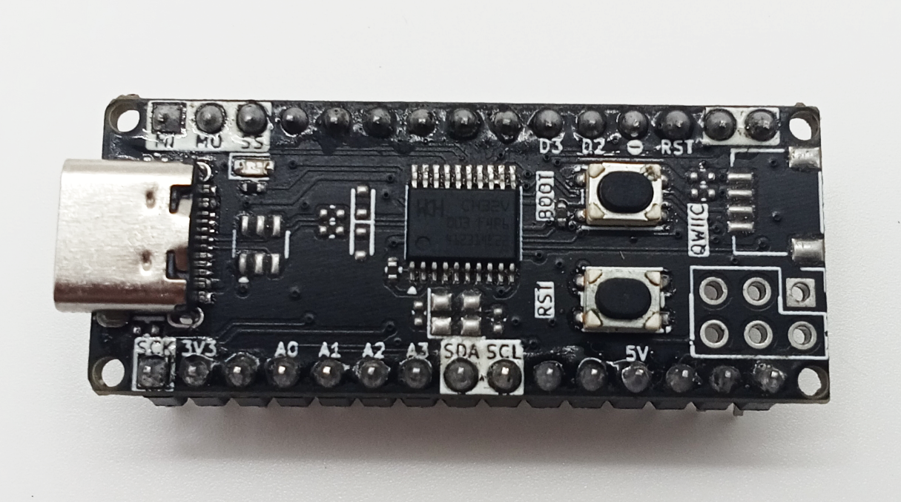

Zerobase là một board phát triển dựa trên vi điều khiển CH32. Board hỗ trợ nhiều giao tiếp như I2C, SPI, UART, GPIO, ADC, PWM, và nhiều chức năng khác. 
<br>
<br>
Hướng dẫn này trình bày chi tiết cách cài đặt bo mạch, nạp code và nháy LED với Zerobase trên Arduino IDE.

## Pinouts
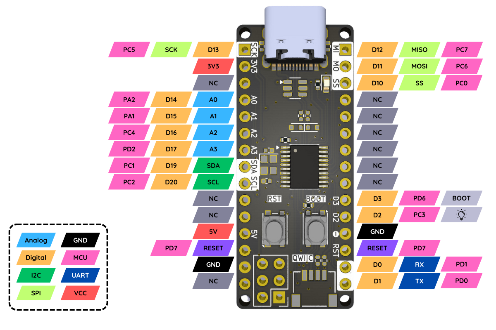
<br>
<br>
Zerobase được trang bị đầy đủ các tính năng mạnh mẽ của vi điều khiển. Ngoài ra, bo mạch còn cung cấp nhiều chân và cổng giao tiếp. Hãy cùng khám phá chi tiết ngay sau đây!

### Chân cấp nguồn
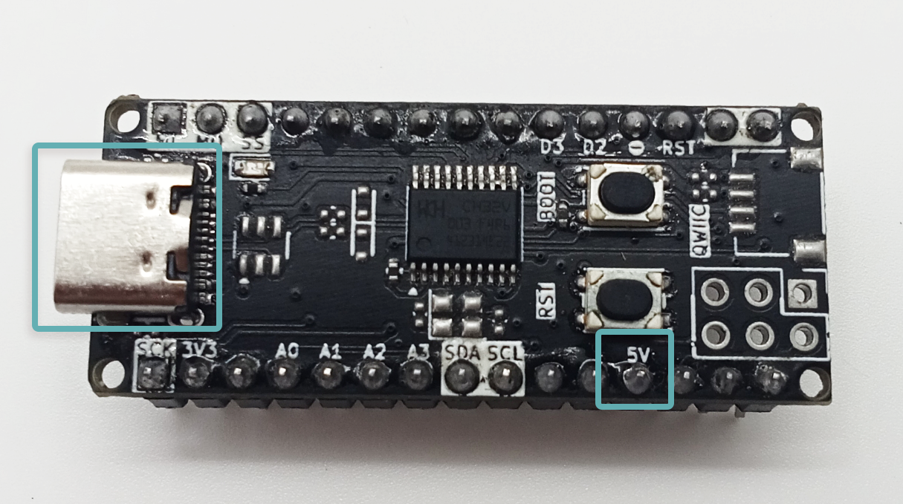
- **5V**: Chân này có thể nhận nguồn 5VDC (input) hoặc cấp nguồn cho thiết bị khác (output).
- **USB**: Zerobase cũng hỗ trợ cấp nguồn qua cổng USB.

### Chân GPIO
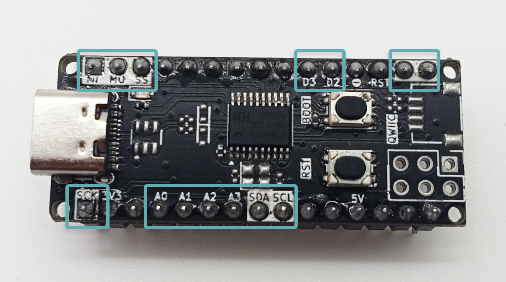

!> Mức logic: 5V.

!> Toàn bộ chân GPIO đều hỗ trợ PWM.

!> Toàn bộ chân GPIO đều hỗ trợ ngắt ngoại vi.

!> Toàn bộ chân GPIO đều hỗ trợ INPUT/OUTPUT.

- **D0**: GPIO0, có thể dùng làm chân nhận dữ liệu (RX) cho Serial1 (UART1).
- **D1**: GPIO1, có thể dùng làm chân gửi dữ liệu (TX) cho Serial1 (UART1).
- **D2**: GPIO2.
- **D3**: GPIO3.
- **D10**: GPIO10, có thể dùng làm chân Select Slave (NSS) cho SPI.
- **D11**: GPIO11, có thể dùng làm chân Master Out Slave In (MOSI) cho SPI.
- **D12**: GPIO12, có thể dùng làm chân Master In Slave Out (MISO) cho SPI.
- **D13**: GPIO13, có thể dùng làm chân Clock (SCK) cho SPI.
- **D14**: GPIO14, có thể dùng làm chân Analog Input (A0).
- **D15**: GPIO15, có thể dùng làm chân Analog Input (A1).
- **D16**: GPIO16, có thể dùng làm chân Analog Input (A2).
- **D17**: GPIO17, có thể dùng làm chân Analog Input (A3).
- **D18**: GPIO18, có thể dùng làm chân Serial Data (SDA) cho I2C.
- **D19**: GPIO19, có thể dùng làm chân Serial Clock (SCL) cho I2C.

### Các chân khác
**BOOT**: Chân này dùng để đưa vi điều khiển vào chế độ nạp code.

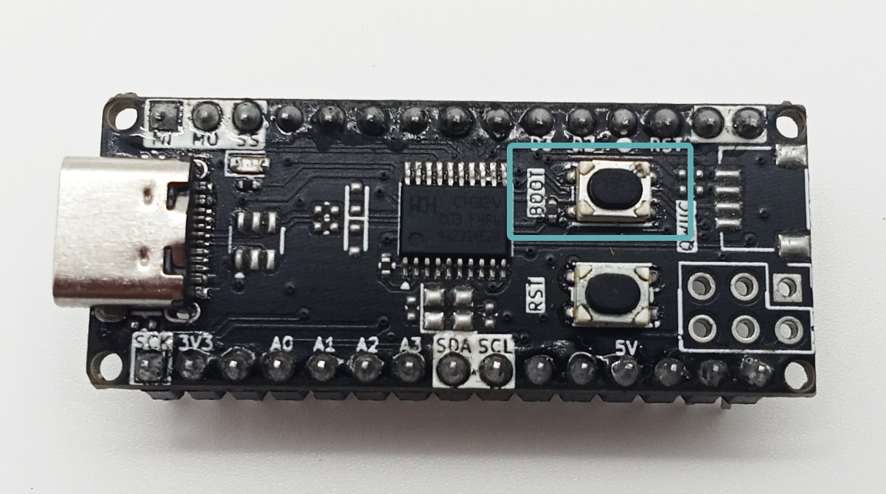
<br>
<br>
**RESET**: Chân này dùng để khởi động lại vi điều khiển.

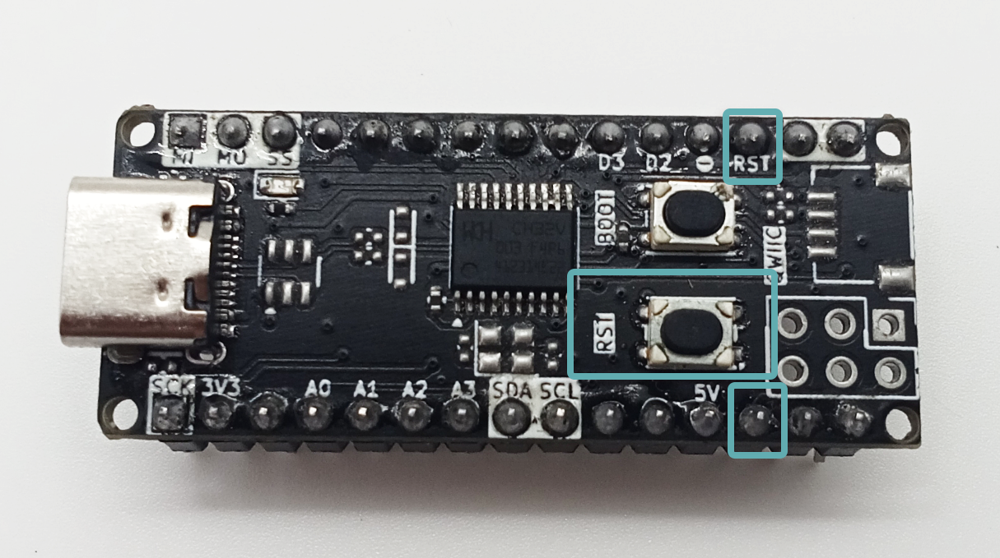

## Cài đặt Arduino IDE và board Zerobase
Để có thể lập trình cho Zerobase, đầu tiên bạn cần tải và cài đặt Arduino IDE phiên bản mới nhất theo đường link sau: [Arduino IDE](https://www.arduino.cc/en/software).

Sau khi cài đặt xong, bạn cần cài đặt board Zerobase trên Arduino IDE theo các bước sau:

Mở **Arduino IDE**. Sau đó vào **File > Preferences**.

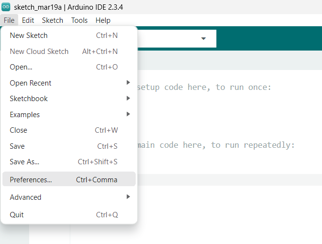

Một hộp thoại sẽ xuất hiện giống như hình dưới đây.

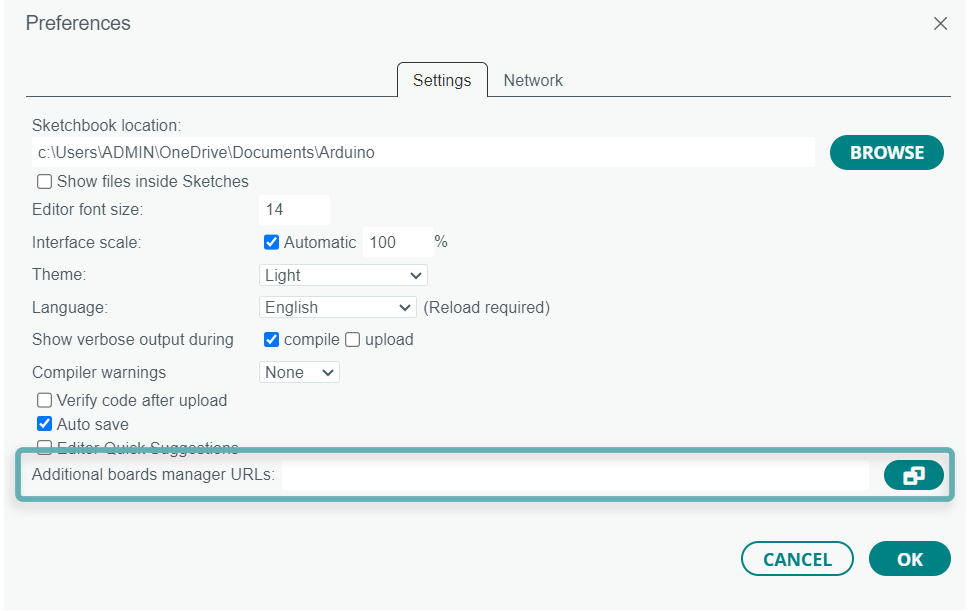

Trong mục **Additional Board Manager URLs**, thêm đường dẫn sau:

 ```link
https://raw.githubusercontent.com/ChipstackLTD/zerobase-board-manager/refs/heads/master/zerobase.json
 ```

Sau khi dán đường dẫn, nhấn **OK** để lưu lại.

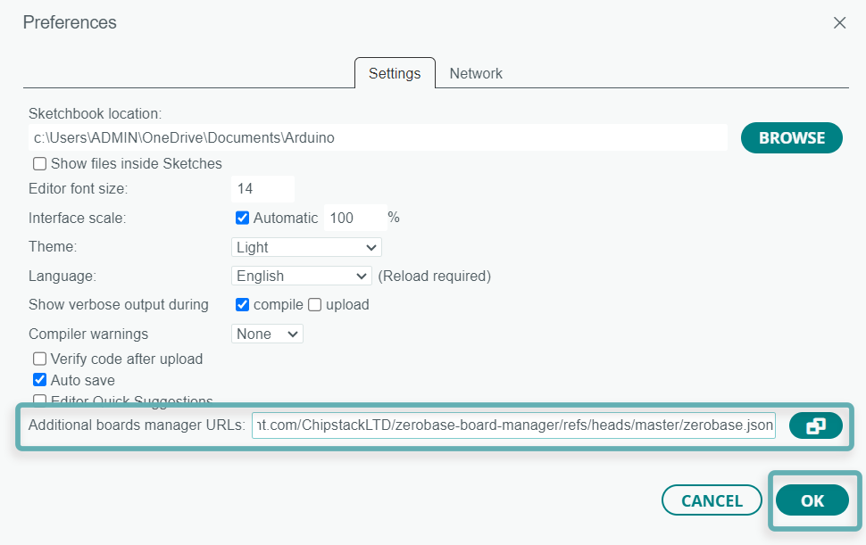

Sau khi nhấn **OK**, ở góc dưới cùng bên trái sẽ hiển thị quá trình tải board Zerobase, chờ cho quá trình tải hoàn tất.

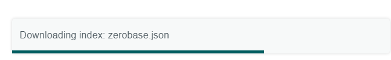

Khi quá trình tải hoàn tất, bạn vào **Tools > Board > Boards Manager**.

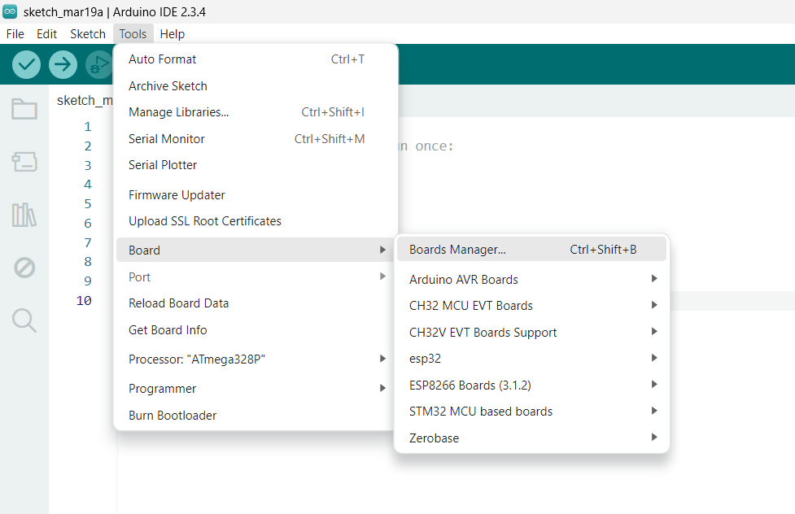

Tìm kiếm tên board: `ZB`, chọn version mới nhất và nhấn **Install**.

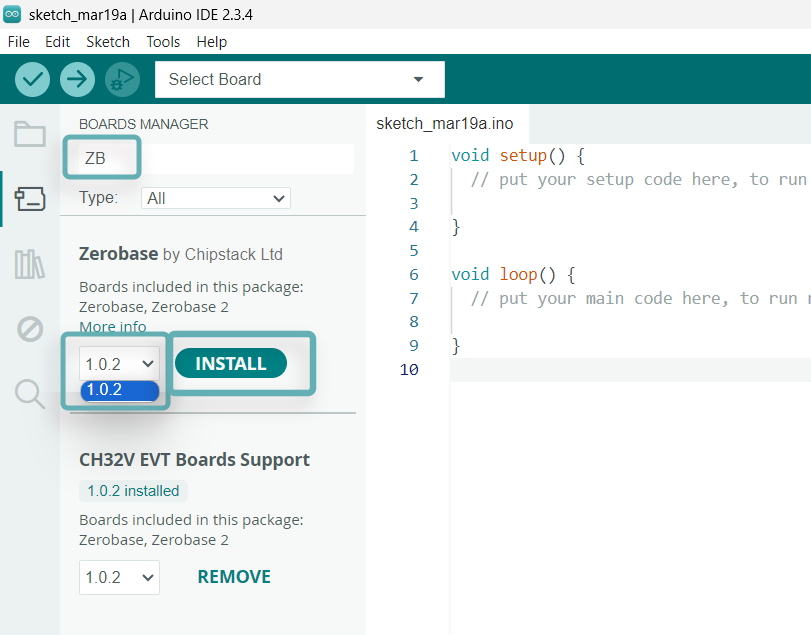

Sau khi nhấn **Install**, quá trình cài đặt board Zerobase sẽ bắt đầu. Chờ cho quá trình cài đặt hoàn tất. Sau khi cài đặt hoàn tất, kết quả sẽ hiển thị như hình dưới đây.

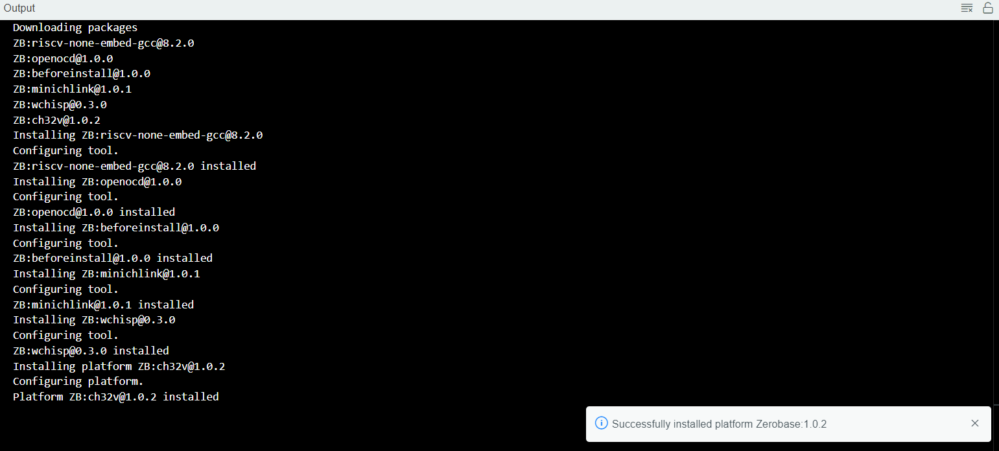

Thoát khỏi Arduino IDE và mở lại để sử dụng board Zerobase.

## Nạp Code và nháy LED

Để chọn board Zerobase, bạn vào **Tools > Board**, chọn Zerobase.

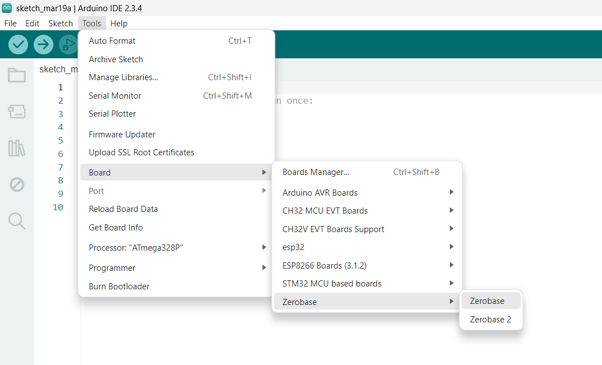

Bạn có thể sử dụng code mẫu để nháy LED trên Zerobase bằng cách vào **File > Examples > DigitalIO > Blink**.

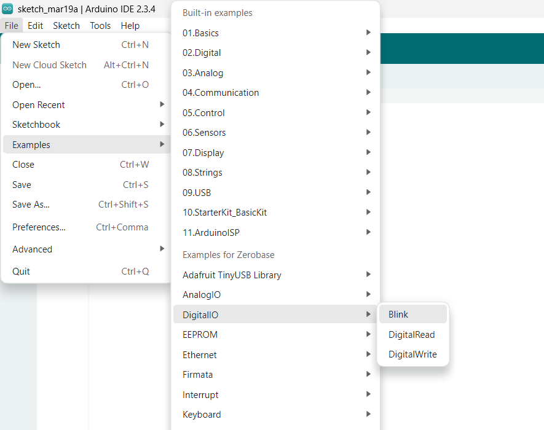

Arduino IDE sẽ mở ra một cửa sổ mới chứa code mẫu nháy LED.

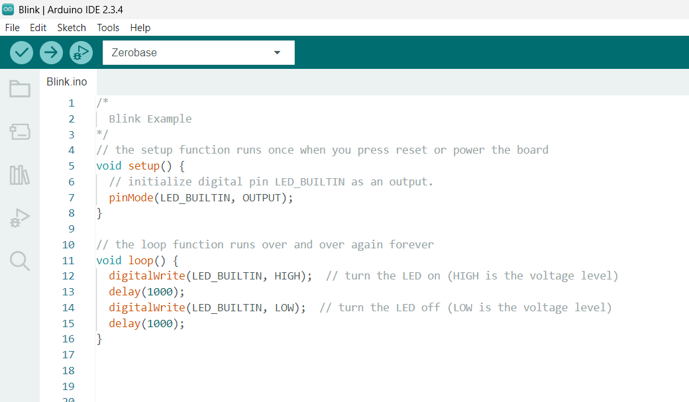

Nếu không thể mở code mẫu, bạn có thể sử dụng đoạn code sau:

```c
void setup() {
  // Khởi tạo chân LED_BUILTIN làm đầu ra (OUTPUT)
  pinMode(LED_BUILTIN, OUTPUT);
}

// Hàm loop chạy lặp lại liên tục
void loop() {
  digitalWrite(LED_BUILTIN, HIGH);  // Bật LED (HIGH tương ứng với mức điện áp cao)
  delay(1000);                      // Dừng 1 giây (1000ms)
  
  digitalWrite(LED_BUILTIN, LOW);   // Tắt LED (LOW tương ứng với mức điện áp thấp)
  delay(1000);                      // Dừng 1 giây (1000ms)
}
```

Bạn kết nối board Zerobase với máy tính bằng cáp USB.

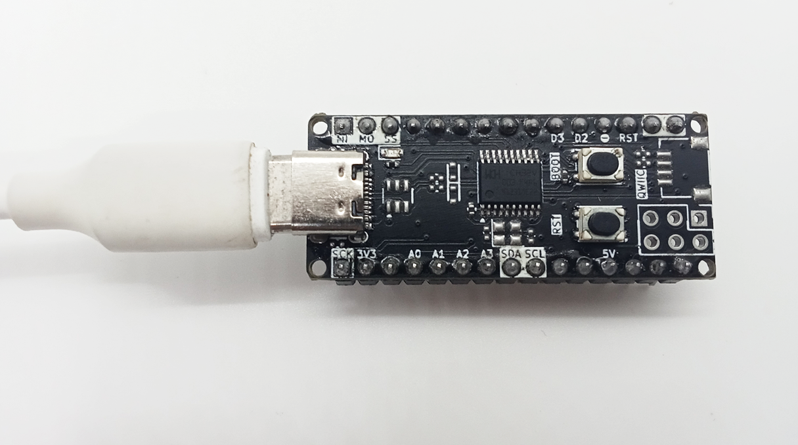

Để nạp code bạn nhấn giữ nút **BOOT**. Sau đó nhấn nút **RESET** rồi thả nút **RESET** này ra. Cuối cùng, thả nút **BOOT**. Board Zerobase sẽ vào chế độ nạp code.

<p align="center">
  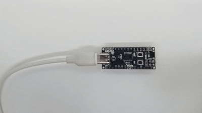
</p>

Bạn nhấn **Upload** hoặc nhấn **Ctrl+U** để nạp code.

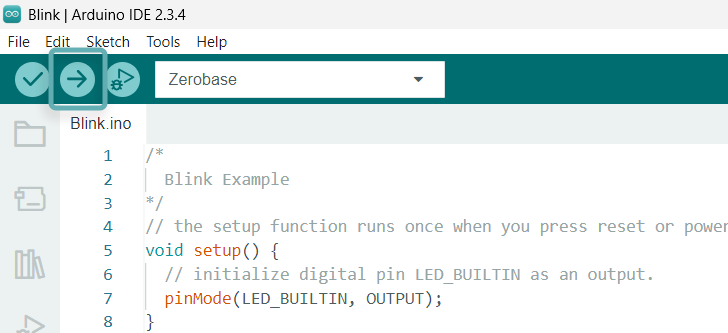

Nếu nạp code thành công, bạn sẽ thấy dòng thông báo như hình dưới đây.

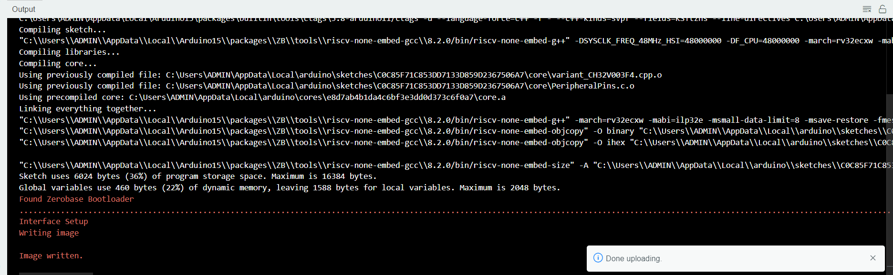

Nhấn nút **RESET** để Zenobase chạy đoạn code bạn vừa nạp.


Kết quả cuối cùng, bạn sẽ thấy LED trên board Zerobase nháy theo chu kỳ 1 giây.

<p align="center">
  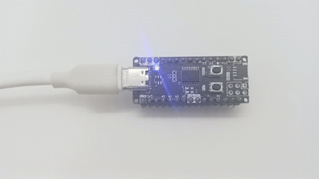
</p>

## Kết luận

Như vậy, bạn đã hoàn thành việc cài đặt board Zerobase, nạp code và nháy LED trên Zerobase. Bạn có thể thử nghiệm các chức năng khác của Zerobase bằng cách thay đổi code mẫu hoặc viết code mới.